<div align="center">
    <h1>Power meter project</h1>
    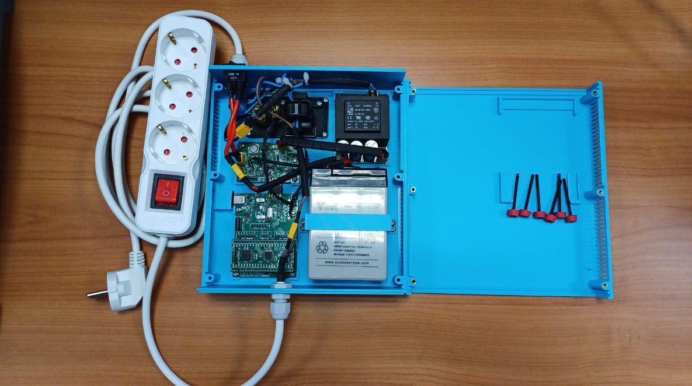 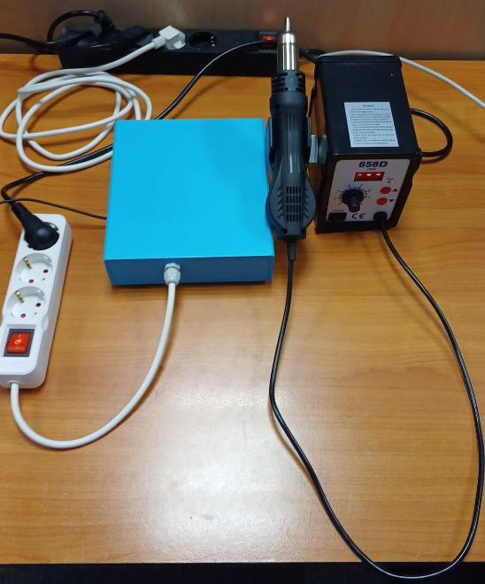
</div>


<!-- ______________________________________________________________________________________________________________________________________________________ -->
# 🚀 Introduction

The increasing number of electrical devices connected to the grid can introduce disturbances that affect the quality of the supplied power and the operation of connected equipment.
**Power quality monitoring** is therefore essential for detecting issues such as voltage fluctuations and grid outages before they lead to equipment malfunction or damage.

This project implements a custom **hardware and software solution for monitoring electrical power quality and energy consumption**.
The system measures key electrical parameters, detects power quality disturbances, and monitors grid outages.

The project covers the complete development process, including **custom hardware design, embedded firmware, signal acquisition and processing, and data visualization**.

See the [Results](#-results) section for the measured results.


<!-- ______________________________________________________________________________________________________________________________________________________ -->
# 📒 Table of content

- [🚀 Introduction](#-introduction)
- [📒 Table of content](#-table-of-content)
- [📄 System Overview](#-system-overview)
  - [Monitored Parameters](#monitored-parameters)
  - [System Operation](#system-operation)
  - [Power Supply](#power-supply)
  - [System Architecture](#system-architecture)
- [🛠️ Tools Used](#️-tools-used)
- [📂 Repository structure](#-repository-structure)
- [⚙️ Components](#️-components)
  - [PIC16F18346](#pic16f18346)
  - [dsPIC33CK256MP205](#dspic33ck256mp205)
  - [MCP3911](#mcp3911)
  - [ESP8266](#esp8266)
  - [DS3231](#ds3231)
  - [MCP2221A](#mcp2221a)
- [🧰 Hardware Implementation](#-hardware-implementation)
  - [Device Architecture](#device-architecture)
  - [Board P1 — Rectifier Board](#board-p1--rectifier-board)
  - [Board P2 — Battery Charger](#board-p2--battery-charger)
  - [Board P3 — Data Acquisition Board](#board-p3--data-acquisition-board)
  - [Board P4 — dsPIC Module](#board-p4--dspic-module)
  - [Final Product](#final-product)
- [💻 Software Implementation](#-software-implementation)
  - [Microcontroller](#microcontroller)
    - [UART1 and GUI](#uart1-and-gui)
    - [UART2 and ESP8266](#uart2-and-esp8266)
    - [UART3 and BMS](#uart3-and-bms)
    - [I2C2 and DS3231](#i2c2-and-ds3231)
    - [SPI1 and MCP3911](#spi1-and-mcp3911)
    - [POWER\_EN and Power Grid Outage Monitoring](#power_en-and-power-grid-outage-monitoring)
    - [RMS Measurement](#rms-measurement)
  - [Windows Application](#windows-application)
- [🥳 Results](#-results)
- [🌟 Future work](#-future-work)
- [🏁 Conclusions](#-conclusions)
- [🔎 Resources](#-resources)
- [❓ Glossary](#-glossary)


<!-- ______________________________________________________________________________________________________________________________________________________ -->
# 📄 System Overview

The device was designed to monitor both **energy consumption of connected equipment** and **electrical grid power quality**.

## Monitored Parameters

**Equipment energy consumption**:
* Voltage and current
* Apparent power

**Grid power quality**:
* Grid outages and their duration
* Voltage fluctuations, including sags and surges


## System Operation

The device connects directly to the electrical grid and continuously measures the supplied voltage.
A household appliance can be connected through the device using an extension cord, allowing its electrical consumption and the quality of the supplied power to be monitored simultaneously.

Measurement data is **acquired and processed locally** before being transmitted through a serial interface to a Windows application for visualization and analysis.

A Wi-Fi module is also integrated to support future wireless communication.
This will allow measurement data to be transmitted to a remote server for visualization and storage without requiring physical access to the device.
Configuration parameters, such as Wi-Fi credentials, are stored in non-volatile memory.


## Power Supply

The device supports **battery-backed operation** to continue monitoring during grid outages.

Under normal conditions, the system is powered from the electrical grid.
When a grid outage is detected, the power source automatically switches to a battery, providing at least **24 hours of autonomous operation**.
Once grid power is restored, the system automatically switches back to the grid and recharges the battery.


## System Architecture

The system is divided into several independent modules to simplify development and allow future improvements.

Two microcontrollers are used:
* **Battery management MCU** - handles battery charging and power management
* **Data acquisition MCU** - handles measurement, signal processing, communication, and system control

The electronics are housed in a **custom 3D-printed enclosure**.

> [!IMPORTANT]
> I developed the device, **excluding the battery-charging subsystem**, specifically the charging algorithm and digital buck converter.

Acronyms used throughout the documentation are listed in the [Glossary](#-glossary), while additional resources are available in the [Resources](#-resources) section.


<!-- ______________________________________________________________________________________________________________________________________________________ -->
# 🛠️ Tools Used

The following tools were used throughout the development of the project:

* **Altium Designer** - schematic and PCB design
* **MPLAB X** - embedded firmware development
* **Fusion 360** - 3D modeling
* **PrusaSlicer** - 3D model slicing and G-code generation

A **logic analyzer** was used for low-level debugging and communication analysis.


<!-- ______________________________________________________________________________________________________________________________________________________ -->
# 📂 Repository structure

The repository is organized as follows:

```
.
├── docs
│   └── images    # Images used in the README
└── README.md
```


<!-- ______________________________________________________________________________________________________________________________________________________ -->
# ⚙️ Components

The main components used to implement the device are listed below.
Detailed descriptions of the key components and their role in the system are provided in the following sections.

| Component                   | Quantity | Purpose                                                              | Link                                                                                                                                                                                                                   |
| --------------------------- | -------: | -------------------------------------------------------------------- | ---------------------------------------------------------------------------------------------------------------------------------------------------------------------------------------------------------------------- |
| **PIC16F18346**             |        1 | Battery charging and power management                                | [ Datasheet ]( https://ww1.microchip.com/downloads/en/DeviceDoc/PIC16-L-F18326-18346-Data-Sheet-40001839D.pdf )                                                                                                        |
| **dsPIC33CK256MP205**       |        1 | Data acquisition, signal processing, and system control              | [ Datasheet ]( https://ww1.microchip.com/downloads/aemDocuments/documents/MCU16/ProductDocuments/DataSheets/dsPIC33CK256MP508-Family-Data-Sheet-DS70005349.pdf )                                                       |
| **MCP3911**                 |        1 | Synchronous dual-channel Σ-Δ ADC for voltage and current acquisition | [ Datasheet ]( https://ww1.microchip.com/downloads/aemDocuments/documents/MSLD/ProductDocuments/DataSheets/MCP3911-3.3V-Two-Channel-Analog-Front-End-DS20002286D.pdf )                                                 |
| **ESP8266-01S**             |        1 | Wi-Fi connectivity                                                   | [ Module ]( https://ro.mouser.com/ProductDetail/SparkFun/WRL-17146?qs=DPoM0jnrROXqYUXDsg9bzA%3D%3D ) / [ Datasheet ]( https://www.espressif.com/sites/default/files/documentation/esp8266-technical_reference_en.pdf ) |
| **DS3231**                  |        1 | Real-time clock                                                      | [ Datasheet ]( https://www.analog.com/media/en/technical-documentation/data-sheets/DS3231.pdf )                                                                                                                        |
| **MCP2221A**                |        1 | USB-to-UART bridge                                                   | [ Datasheet ]( https://ww1.microchip.com/downloads/en/devicedoc/20005565b.pdf )                                                                                                                                        |
| **Power transformer**       |        1 | Power supply                                                         | -                                                                                                                                                                                                                      |
| **Voltage transformer**     |        1 | Grid voltage measurement                                             | -                                                                                                                                                                                                                      |
| **Current transformer**     |        1 | Load current measurement                                             | -                                                                                                                                                                                                                      |
| **Lead-acid battery**       |        1 | Backup power supply                                                  | -                                                                                                                                                                                                                      |
| **Custom 3D-printed parts** |        — | Mechanical enclosure and components                                  | -                                                                                                                                                                                                                      |

<!-- ------------------------------------------------------------------------------------------------------------------------------------------------------ -->
## PIC16F18346

The [ PIC16F18346 ]( https://ww1.microchip.com/downloads/en/DeviceDoc/PIC16-L-F18326-18346-Data-Sheet-40001839D.pdf ) microcontroller is used to implement the **battery charging subsystem**.

The **NCO, CWG, and PWM** peripherals are used to control the battery charging process, while the **EUSART** peripheral provides communication with the main data acquisition MCU. The device provides **14 KB of program memory, 1 KB of RAM, and 18 I/O pins**.


<!-- ------------------------------------------------------------------------------------------------------------------------------------------------------ -->
## dsPIC33CK256MP205

The [ dsPIC33CK256MP205 ]( https://ww1.microchip.com/downloads/aemDocuments/documents/MCU16/ProductDocuments/DataSheets/dsPIC33CK256MP508-Family-Data-Sheet-DS70005349.pdf ) is used for **data acquisition, signal processing, and communication**.

Key features used by the system include:

* **256 KB Flash** and **24 KB RAM** for firmware and measurement data processing
* **3 UART, I²C, and SPI** interfaces for communication with the system peripherals
* **CRC module** for hardware-accelerated data integrity checks
* **8 MHz internal oscillator** and programmable PLLs for flexible system clock configuration
* **Multiple interrupt sources** for implementing the real-time functionality of the device
* **Remappable peripheral pins** for optimizing the PCB layout

The available RAM allows larger buffers to be allocated for measurement data and processing, while the flexible interrupt and peripheral configuration supports the device's real-time, multi-interface architecture.


The dsPIC33CK256MP205 provides **4 DMA channels** ( [ datasheet link ]( https://ww1.microchip.com/downloads/aemDocuments/documents/MCU16/ProductDocuments/DataSheets/dsPIC33CK256MP508-Family-Data-Sheet-DS70005349.pdf#page=211 ) ), allowing data transfers to be performed without direct CPU intervention.
This is particularly useful for the data acquisition system, where frequent transfers between peripherals and memory are required.

**FIGURE 1: DMA data transfer types**

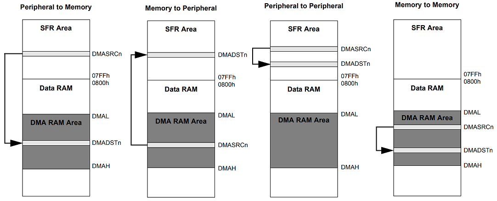

DMA transfers can be performed between RAM and peripherals, RAM and RAM, or peripherals and peripherals.
The module provides **86 configurable triggers**, including UART reception and change notification interrupts, and supports both **8-bit and 16-bit transfers**.

The DMA controller supports four operating modes:

1. **One-shot** - performs a configured number of transfers for each trigger, then disables the channel.
2. **Repeated one-shot** - performs one transfer sequence per trigger and reloads the initial addresses for the next sequence.
3. **Continuous** - performs the configured number of transfers from a single trigger, then disables the channel.
4. **Repeated continuous** - continuously repeats the configured transfer sequence, reloading the initial addresses after each sequence.

These capabilities allow the DMA to handle high-frequency data transfers efficiently, reducing CPU intervention and making it well suited for the system's **real-time data acquisition and processing**.


<!-- ------------------------------------------------------------------------------------------------------------------------------------------------------ -->
## MCP3911

Voltage and current measurements are performed using the [ MCP3911 ]( https://ww1.microchip.com/downloads/aemDocuments/documents/MSLD/ProductDocuments/DataSheets/MCP3911-3.3V-Two-Channel-Analog-Front-End-DS20002286D.pdf ), a dual-channel analog front-end with integrated **Σ-Δ ADCs**.

The two input channels are differential, providing **common-mode voltage rejection**, while simultaneous sampling ensures that the voltage and current measurements remain synchronized without introducing a phase shift between the acquired signals.

The integrated Σ-Δ ADCs provide selectable resolutions from **16 to 24 bits**.
Their noise-shaping architecture helps reduce the influence of noise on the measurements, while the device is designed to minimize temperature-induced measurement drift.

Communication with the MCP3911 is performed through the **SPI interface**, which supports clock frequencies up to **20 MHz**.
A synchronization signal is also used to indicate the completion of a data acquisition cycle.


<!-- ------------------------------------------------------------------------------------------------------------------------------------------------------ -->
## ESP8266

**FIGURE 2: ESP8266 module**

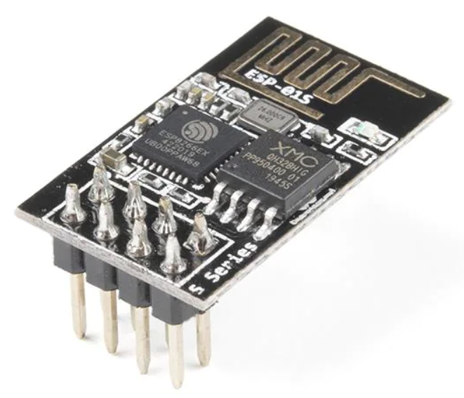

An [ ESP8266-01-S ]( https://www.espressif.com/sites/default/files/documentation/esp8266-technical_reference_en.pdf ) module ( **Figure 2** ) was integrated to provide **Wi-Fi connectivity**.

The module supports **SPI and UART** communication; UART is used in the current implementation.
Configuration and control are performed using [ AT commands ]( https://room-15.github.io/blog/2015/03/26/esp8266-at-command-reference/ ).

The default UART baud rate is **115200 baud**, which can be configured according to the application requirements.
The module operates from a **3.3 V supply**.


<!-- ------------------------------------------------------------------------------------------------------------------------------------------------------ -->
## DS3231

The duration of grid outages is measured using the [ DS3231 ]( https://www.analog.com/media/en/technical-documentation/data-sheets/DS3231.pdf ), a high-precision **real-time clock / calendar ( RTCC )**.

The integrated temperature-compensated oscillator provides an accuracy of **±2 ppm** over **0 to +40 °C** and **±3.5 ppm** over **−40 to +85 °C**.
Dedicated registers compensate for oscillator aging and temperature variations.

Communication with the DS3231 is performed using the **I²C interface**, supporting frequencies up to **400 kHz** in Fast mode.
The device can generate a **1 Hz interrupt**, which is used to facilitate grid outage duration measurement.

The device operates from a **3.3 V supply**.


<!-- ------------------------------------------------------------------------------------------------------------------------------------------------------ -->
## MCP2221A

The [ MCP2221A ]( https://ww1.microchip.com/downloads/en/devicedoc/20005565b.pdf ) USB-to-UART bridge provides the interface between the **Windows application and the dsPIC**, converting USB communication from the PC to UART communication used by the microcontroller.

The MCP2221A also supports **I²C**, but UART was selected for the application due to its simplicity and higher data-transfer rate.

UART is configured at **460800 baud**, with an error of **0.16%**.
Each transmitted byte requires **10 bits**: one start bit, eight data bits, and one stop bit.


<!-- ______________________________________________________________________________________________________________________________________________________ -->
# 🧰 Hardware Implementation

This section describes the hardware implementation of the device.

For each board, a block diagram illustrates the connections between the main components.
The following color coding is used to distinguish between different connection types:

- ${\textsf{\color{green}green}}$  - AC power
- ${\textsf{\color{red}red}}$, ${\textsf{\color{blue}blue}}$ and black - DC power
- ${\textsf{\color{orange}orange}}$ - analog signals
- ${\textsf{\color{purple}purple}}$ - digital signals


<!-- ------------------------------------------------------------------------------------------------------------------------------------------------------ -->
## Device Architecture

The device is divided into **four PCBs**, each responsible for a specific part of the system:

* **Board P1 - Rectifier:** Converts the **230 VAC grid voltage** to **DC voltage** ( 9 V DC at 0.833 A load ) to power the device. The power transformer is located on this board.
* **Board P2 - Battery Charger:** Manages the power source and battery charging. When grid power is available, the board powers the system and charges the battery. During a grid outage, it switches to battery power to keep the device operating. The **PIC16F18346** is located on this board.
* **Board P3 - Data Acquisition:** Handles signal acquisition and communication with the computer. It also provides two connectors for the P4 dsPIC module. The **MCP2221A, MCP3911, and ESP8266** are located on this board, while the voltage and current transformers are connected through external cables.
* **Board P4 - dsPIC Module:** Contains the main microcontroller responsible for processing the data acquired by P3. The **dsPIC33CK256MP205** and **DS3231** are located on this board.

The overall system architecture is shown in the figure below.


**FIGURE 3: Device architecture**

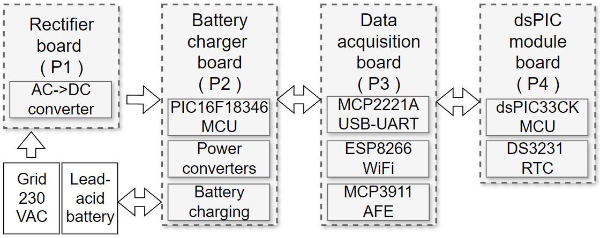


Some components are selectively enabled or disabled depending on the grid status to **reduce power consumption during battery-backed operation**.

> [!IMPORTANT]
> I developed the device, **excluding the battery-charging subsystem**, including its charging algorithm and digital buck converter.


<!-- ------------------------------------------------------------------------------------------------------------------------------------------------------ -->
## Board P1 — Rectifier Board

**FIGURE 4: P1 functional block**

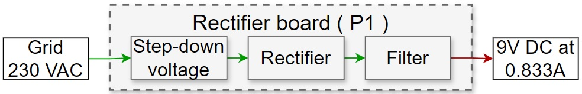

Board P1 converts the **230 VAC** grid voltage to **DC power** to supply the rest of the device. The power transformer is located on this board.


<!-- ------------------------------------------------------------------------------------------------------------------------------------------------------ -->
## Board P2 — Battery Charger

**FIGURE 5: P2 functional block**

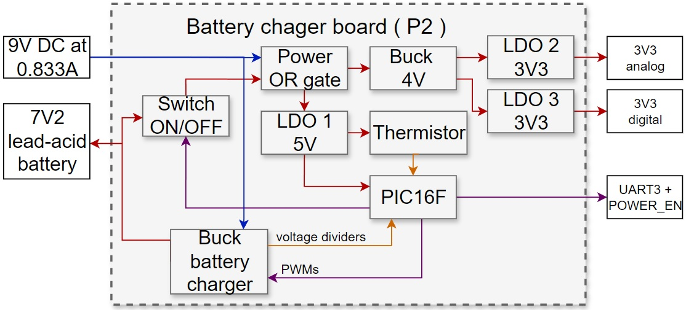

Board P2 manages the **power supply for boards P3 and P4** and controls the battery charging process.
When grid power is available, the board supplies the system and charges the lead-acid battery.
During a grid outage, it automatically switches to battery power to keep the device operating.

The board provides the **3.3 V supply** for the digital and analog circuitry on the remaining boards.
Battery temperature is monitored using an **NTC thermistor**, whose resistance decreases as temperature increases.

The **dsPIC** periodically monitors the battery voltage, charging current, battery state, board temperature, and input voltage through **UART3**.
The **POWER_EN** signal indicates the active power source:
* **Logical 1** - device powered from the grid
* **Logical 0** - device powered from the battery


<!-- ------------------------------------------------------------------------------------------------------------------------------------------------------ -->
## Board P3 — Data Acquisition Board

**FIGURE 6: P3 functional block**

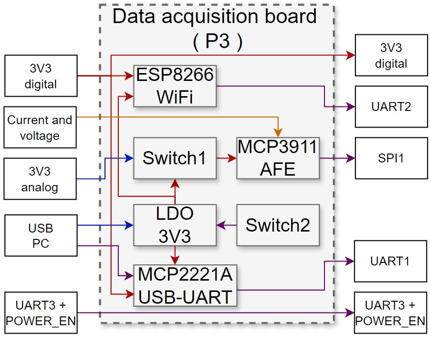

Board P3 handles **data acquisition**, manages communication with the Windows application, and facilitates communication between the device's components.

Two switches and an LDO were included to simplify development and testing, allowing the P3 and P4 boards to be powered directly from **USB** without requiring an auxiliary power supply or the complete device assembly.


<!-- ------------------------------------------------------------------------------------------------------------------------------------------------------ -->
## Board P4 — dsPIC Module

**FIGURE 7: P4 functional block**

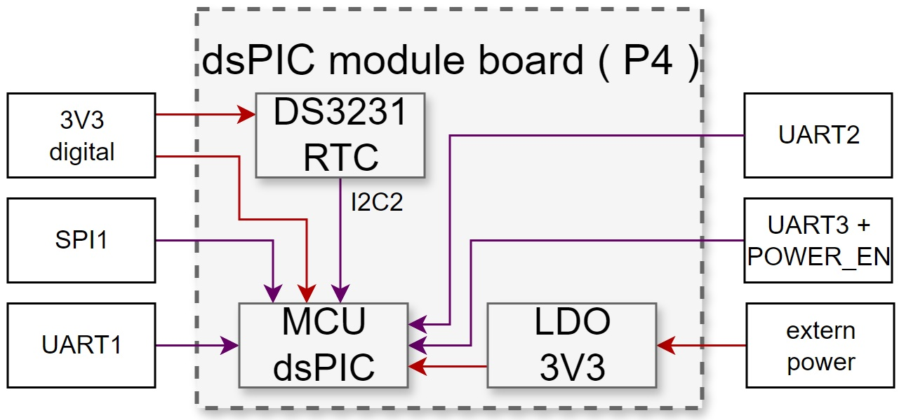

Board P4 contains the **dsPIC33CK256MP205** and **DS3231 RTC**.
Its main functions are to **process the data acquired by P3 and manage communication between the device components**.


<!-- ------------------------------------------------------------------------------------------------------------------------------------------------------ -->
## Final Product

The device components are housed in a **custom 3D-printed enclosure** designed to accommodate the system's hardware and connections.

**FIGURE 8: Device components**


**FIGURE 9: Device in operation**


Figure 9 shows the device powered from a wall outlet with a **hot-air soldering station** connected through the extension cord.
The station's energy consumption is continuously measured, and the results are displayed in the **Windows application**.


<!-- ______________________________________________________________________________________________________________________________________________________ -->
# 💻 Software Implementation

This section describes the software implementation of the device.

The software architecture of the **Windows application, battery charger, and dsPIC firmware** was designed to be **non-blocking**.
This allows the different parts of the system to operate independently without one stalled operation preventing other tasks from executing.

The system relies on multiple interrupts to handle asynchronous events and peripheral communication.
To prevent data corruption, **shared data accessed by both the main loop and interrupt handlers is carefully synchronized**.


<!-- ------------------------------------------------------------------------------------------------------------------------------------------------------ -->
## Microcontroller

The **dsPIC** is the central controller of the system and implements most of the device's functionality.

Its firmware uses **five independent state machines** to manage communication with the system's peripherals and external interfaces:

* **UART1** — Windows application
* **UART2** — ESP8266 Wi-Fi module
* **UART3** — battery charger
* **SPI1** — MCP3911 ADC
* **I²C2** — DS3231 RTC

The dsPIC acts as the **master** for all interfaces except **UART1**, where the Windows application controls the communication transactions.

The following subsections describe the functionality implemented by the dsPIC.


<!-- ------------------------------------------------------------------------------------------------------------------------------------------------------ -->
### UART1 and GUI

The [ UART1 communication ](https://ww1.microchip.com/downloads/aemDocuments/documents/MCU16/ProductDocuments/DataSheets/dsPIC33CK256MP508-Family-Data-Sheet-DS70005349.pdf#page=363) is used for communication between the **Windows application and the dsPIC**.
The application sends commands to which the dsPIC responds.

The UART operates in **full-duplex mode** at **460800 baud** using the **8N1** format.
**CRC checks** are used to improve communication reliability.

The communication state is reset when a **timeout, CRC error, overflow, frame error, or unknown command** is detected.
Two command types are supported:

* **Read** - retrieves data from the device
* **Write** - modifies device parameters

Commands can have either **fixed or variable lengths**, with a total of **21 commands** currently implemented.


<!-- ------------------------------------------------------------------------------------------------------------------------------------------------------ -->
### UART2 and ESP8266

The [ UART2 communication ]( https://ww1.microchip.com/downloads/aemDocuments/documents/MCU16/ProductDocuments/DataSheets/dsPIC33CK256MP508-Family-Data-Sheet-DS70005349.pdf#page=363 ) is used for communication between the **dsPIC and ESP8266** [ Wi-Fi module ]( https://www.espressif.com/sites/default/files/documentation/esp8266-technical_reference_en.pdf ).

Communication is performed using [ AT commands ]( https://room-15.github.io/blog/2015/03/26/esp8266-at-command-reference/ ) transmitted over UART.
The interface operates in **full-duplex mode** at **115200 baud** using the **8N1** format.

Since remote data transmission is not yet implemented, the current firmware handles **ESP8266 configuration and connection / disconnection to an access point ( AP )**.

The Wi-Fi module is enabled when the device is powered from the **electrical grid** and disabled during **battery-backed operation** to reduce power consumption.

The ESP8266 state machine is shown in **Figure 10**.

**FIGURE 10: ESP8266 state machine**

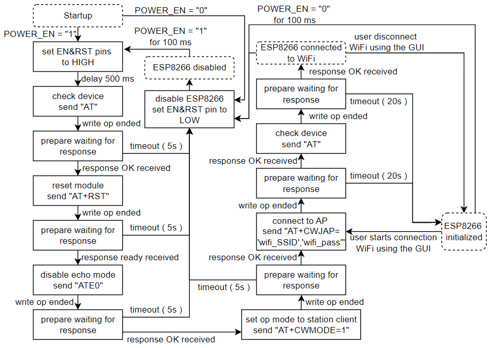

At startup, the Wi-Fi credentials ( `wifi_SSID` and `wifi_pass` ) are initialized with default values.
These parameters can later be modified through the Windows application.

If the ESP8266 does not respond with the expected sequence during the configuration states within **5 seconds**, the state machine stops the module.
The module is also disabled when grid power is no longer available.


<!-- ------------------------------------------------------------------------------------------------------------------------------------------------------ -->
### UART3 and BMS

The [ UART3 communication ]( https://ww1.microchip.com/downloads/aemDocuments/documents/MCU16/ProductDocuments/DataSheets/dsPIC33CK256MP508-Family-Data-Sheet-DS70005349.pdf#page=363 ) is used for communication between the **dsPIC and the battery charger board**.

The dsPIC initiates all transactions and periodically requests the battery parameters from the charger board.
The monitored parameters are:

* Battery status and state
* Battery voltage
* Charging current
* Battery temperature
* P2 input voltage

UART3 operates in **full-duplex mode** at **38400 baud** using the **8N1** format.

The protocol uses **fixed-length, read-only commands**.
The communication state is reset when a **timeout, incorrect XOR check, overflow, frame error, or unknown command** is detected.


<!-- ------------------------------------------------------------------------------------------------------------------------------------------------------ -->
### I2C2 and DS3231

The [ I2C2 communication ]( https://ww1.microchip.com/downloads/aemDocuments/documents/MCU16/ProductDocuments/DataSheets/dsPIC33CK256MP508-Family-Data-Sheet-DS70005349.pdf#page=403 ) is used by the dsPIC to configure and communicate with the [ DS3231 RTC ]( https://www.analog.com/media/en/technical-documentation/data-sheets/DS3231.pdf ).

The interface operates at **100 kHz**, corresponding to the I²C **Standard-mode**, and uses **7-bit slave addressing**.

The RTC is enabled during **battery-backed operation** to measure the duration of grid outages and disabled when grid power is restored.

The communication state is reset if a **timeout occurs**, the DS3231 does not acknowledge its address, or a configuration write operation fails.

**FIGURE 11: I²C read / write example**

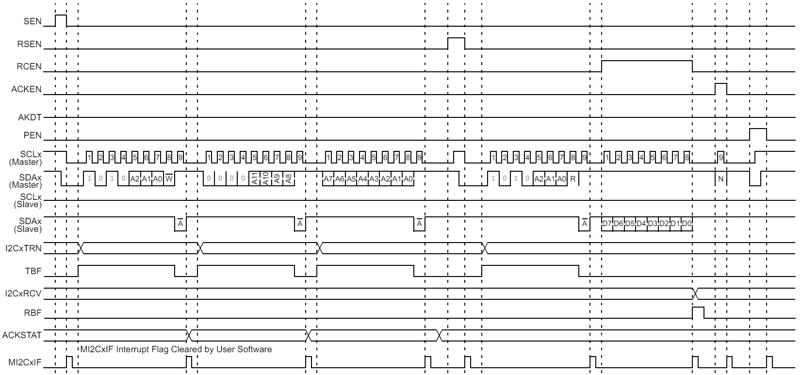

The I²C2 state machine was implemented based on the communication sequence shown in **Figure 11**.
Communication is handled through the **MI2C2IF interrupt**, where control signals are processed and data transmission and reception are performed.

**FIGURE 12: DS3231 register list**

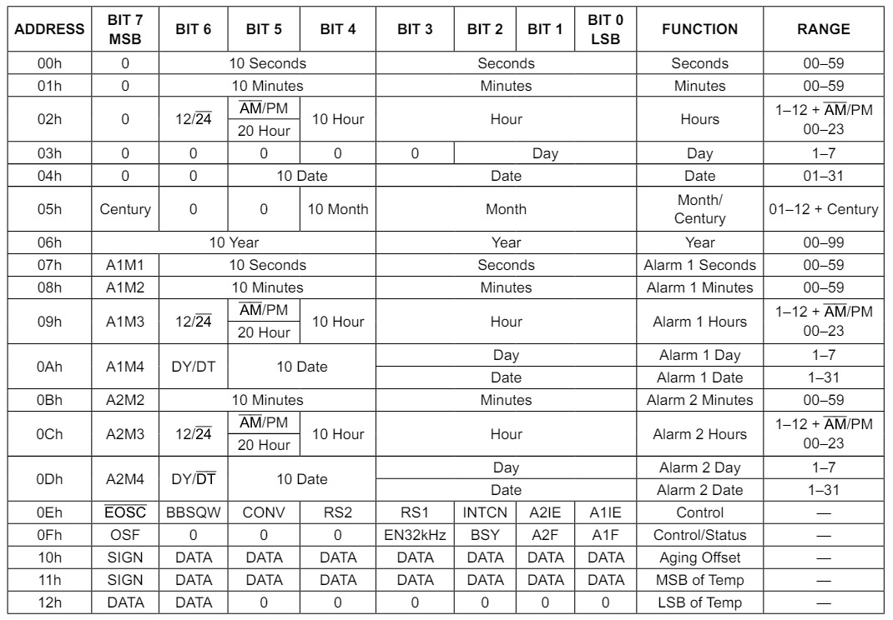

The DS3231 register map is shown in **Figure 12**.
The device provides **13 configuration and status registers** and includes a calendar with leap-year correction, although the calendar functionality is not currently used.

The DS3231 can generate two alarms and square-wave signals at **1 Hz, 1.024 kHz, 4.096 kHz, or 8.192 kHz**.
The **1 Hz output** is used by the system to measure grid outage duration.

The integrated temperature-compensated oscillator provides an accurate time base while compensating for temperature and aging effects.
The oscillator frequency can also be adjusted through the **aging offset register**.

The internal temperature sensor is not used because battery temperature is already monitored using an **external NTC thermistor**.

Future firmware improvements could use the DS3231 calendar to record the **date, time, and duration of grid outages**, with the resulting data stored in non-volatile memory and made available to the Windows application.


<!-- ------------------------------------------------------------------------------------------------------------------------------------------------------ -->
### SPI1 and MCP3911

The [ SPI1 communication ]( https://ww1.microchip.com/downloads/aemDocuments/documents/MCU16/ProductDocuments/DataSheets/dsPIC33CK256MP508-Family-Data-Sheet-DS70005349.pdf#page=385 ) is used to transfer data between the dsPIC and the [ MCP3911 AFE ]( https://ww1.microchip.com/downloads/aemDocuments/documents/MSLD/ProductDocuments/DataSheets/MCP3911-3.3V-Two-Channel-Analog-Front-End-DS20002286D.pdf ).

The SPI clock frequency is set to **10 MHz** and the interface operates in **SPI Mode 3**: the clock is idle high, data is sampled on the falling edge and shifted on the rising edge.

The SPI module's **Enhanced Buffer** is used instead of the Standard Buffer, providing a **128-bit FIFO** for transmit and receive operations.
With an **8-bit word length**, the FIFO can store up to **16 words**.

**FIGURE 13: MCP3911 register list**

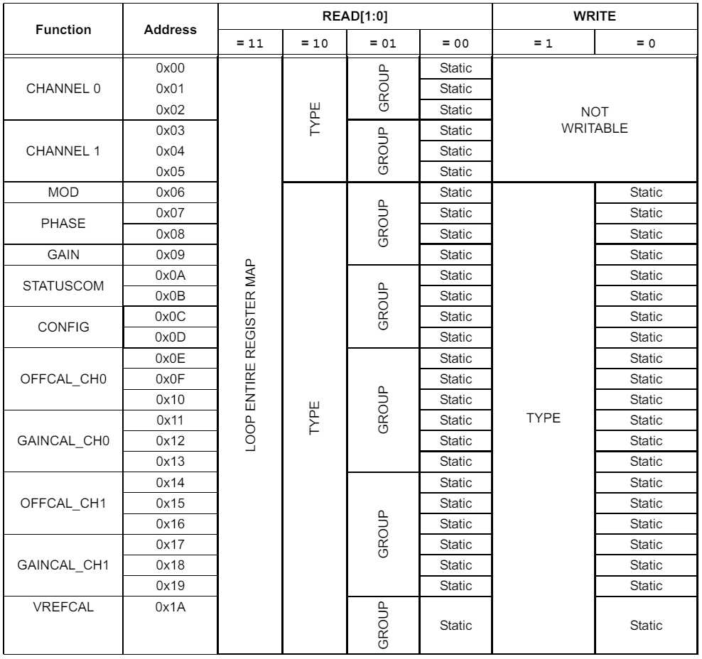

The MCP3911 register structure is shown in **Figure 13**.

The ADC current consumption is not limited, allowing operation at higher sampling frequencies.
The ADC resolution is configured to **16 bits**, although **24-bit resolution** is also supported.

The **nDR ( Data Ready )** signal is configured to generate a single pulse when data from both channels is available.
It remains high while the conversion data is not ready.

The MCP3911 organizes its registers into groups according to their function.
For continuous ADC data acquisition, the read and write address modes are configured using **READ[1:0] = 0b10** and **WRITE = 0b1**.
This allows the ADC data registers to be read continuously without manually updating the address after each read, minimizing communication overhead.

**FIGURE 14: MCP3911 clock structure**

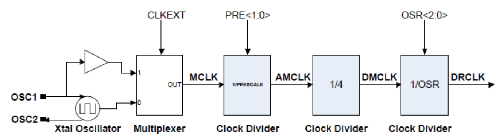

The MCP3911 clock structure is shown in **Figure 14**.

The data rate clock ( **DRCLK** ) is calculated as:

$DRCLK = \frac{DMCLK}{OSR}= \frac{AMCLK}{4 * OSR}= \frac{MCLK}{4 * OSR * PRESCALE}$

With an external **10 MHz** clock, an **OSR of 512** ( `OSR[2:0] = 0b100` ), and a **prescaler of 1** ( `PRE[1:0] = 0b00` ):

$DRCLK = \frac{10 MHz}{4 * 512 * 1} \approx 4,883 Hz$

According to the **Nyquist criterion**, this sampling rate allows signal components up to approximately **≈ 2.441 kHz** to be represented without aliasing.


**FIGURE 15: MCP3911 data acquisition**

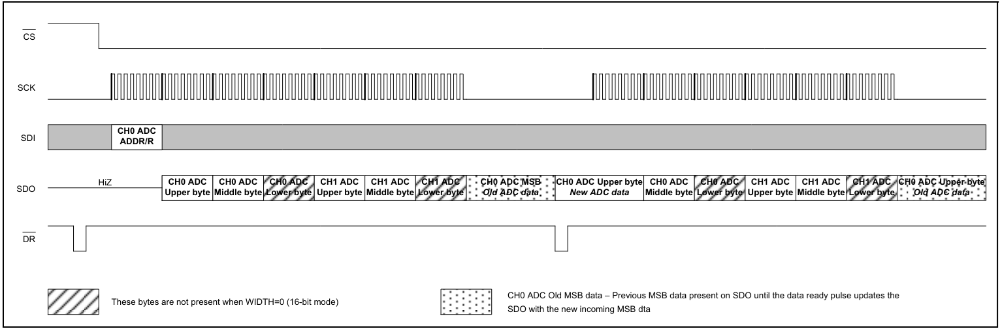

An example of data transfer with the MCP3911 is shown in **Figure 15**.

After configuring the MCP3911, the dsPIC initiates the acquisition process by writing the starting address of the **CHANNEL 0** register.
Subsequently, each **nDR** pulse triggers a 4-byte SPI transaction to read the acquired data.

DMA is used to minimize CPU intervention during this process.
The DMA channel is configured in **repeated continuous mode**, with the following configuration:

* **Trigger:** nDR interrupt
* **Source:** `SPI1BUFL` buffer
* **Destination:** 32-bit data variable
* **Transfer size:** 4 bytes

When nDR transitions from **0 to 1**, the DMA initiates a SPI transfer using a **symmetric null write**.
Data from the destination variable is written to `SPI1BUFL`, while the data received from the MCP3911 is transferred back into the same variable.
The transfer configuration is automatically restored for the next nDR pulse.

After the SPI transaction is completed and the transmit buffer is empty, a flag is set to indicate that a new measurement is available.
The received data is then processed in the **main loop**, which clears the flag after processing.


**FIGURE 16: MCP3911 state machine**

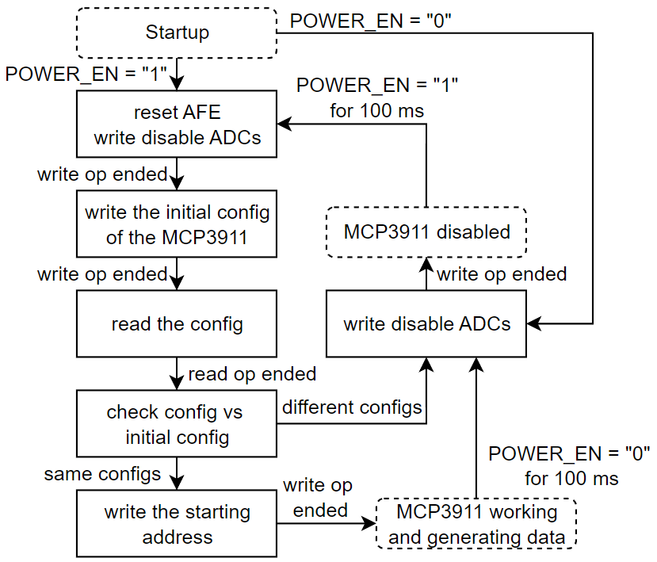

The MCP3911 state machine is shown in **Figure 16**.

At startup, the AFE is enabled or disabled according to the **POWER_EN** signal ( `1` = grid power, `0` = battery power ).
When enabled, the MCP3911 follows the startup sequence recommended in the datasheet: the device is reset, the ADCs are disabled, and the previously described configuration is written.

The configuration is then read back and verified.
If the read-back configuration differs from the expected values, the state machine stops the AFE.
Otherwise, the starting address of the **CHANNEL 0** register is written and continuous data acquisition begins.

The MCP3911 is also disabled when grid power is no longer available.


<!-- ------------------------------------------------------------------------------------------------------------------------------------------------------ -->
### POWER_EN and Power Grid Outage Monitoring

The **POWER_EN** signal, generated by the PIC16F on the battery charger board, indicates the active power source:

* **Logic 1** - grid power is available
* **Logic 0** - grid power is unavailable and the device is powered by the battery

The signal is approximately **0 V** for logic 0 and **3.2 V** for logic 1 after the voltage divider.
Its state is determined by the P2 input voltage using a **hysteresis window** between **8 V and 9 V**.

The dsPIC continuously monitors POWER_EN and accepts a state change only when the new state remains stable for at least **100 ms**.
This prevents short voltage fluctuations from being interpreted as grid outages or restorations.

When a grid outage is detected, the power source automatically switches to the battery through the **OR diode gate** ( **Figure 5** ), while non-essential functions such as the **ESP8266 and MCP3911** are disabled to reduce power consumption.

The **DS3231 RTC** is then enabled and configured to generate a **1 Hz signal**.
A counter increments on each rising edge to measure the outage duration, while a second counter records the total number of detected outages.
Both counters can be viewed and reset through the Windows application.

When grid power is restored, the RTC is disabled and the ESP8266 and MCP3911 are re-enabled.

<!-- ------------------------------------------------------------------------------------------------------------------------------------------------------ -->
### RMS Measurement

To determine the AC power consumption of the connected equipment, the **RMS values of voltage and current** are calculated from the acquired samples.
Both measurement buffers contain **293 samples**.


<!-- ------------------------------------------------------------------------------------------------------------------------------------------------------ -->
## Windows Application

The Windows application was developed in **C# using .NET Framework 4.7 and Windows Forms**.
The application provides a graphical interface for configuring and communicating with the device.

The application is shown in **Figure 17** and **Figure 18**.

**FIGURE 17: Windows application first page**

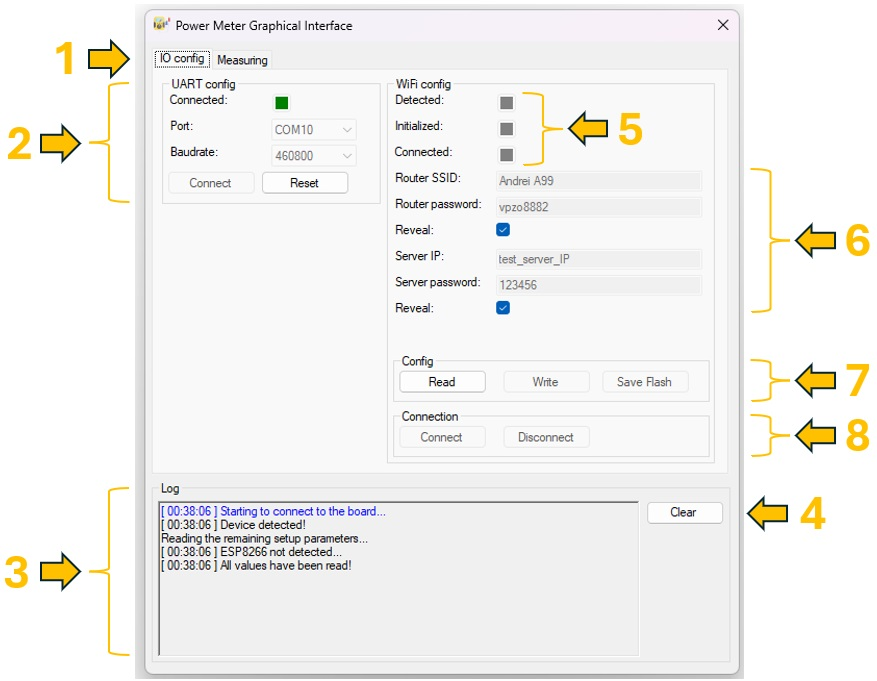

The application is organized in two tab pages ( 1 ).
The first tab provides the following functionality:

1. **Serial communication** - selection of the COM port and baud rate, connection status, starting communication, and application reset ( 2 )
2. **Application log** - displays relevant system and communication messages ( 3 ). The log can be cleared using the **Clear** button ( 4 )
3. **ESP8266 status** - displays the current Wi-Fi module state ( 5 ) using color-coded indicators:
   * **Gray** - state not reached
   * **Orange** - operation in progress
   * **Green** - operation completed successfully
4. **Network configuration** — configuration of the Wi-Fi and server connection parameters ( 6, 7 )
5. **Connection control** — starts or terminates the corresponding connection ( 8 )

The available controls are enabled or disabled according to the current ESP8266 state.

**FIGURE 18: Windows application second page**

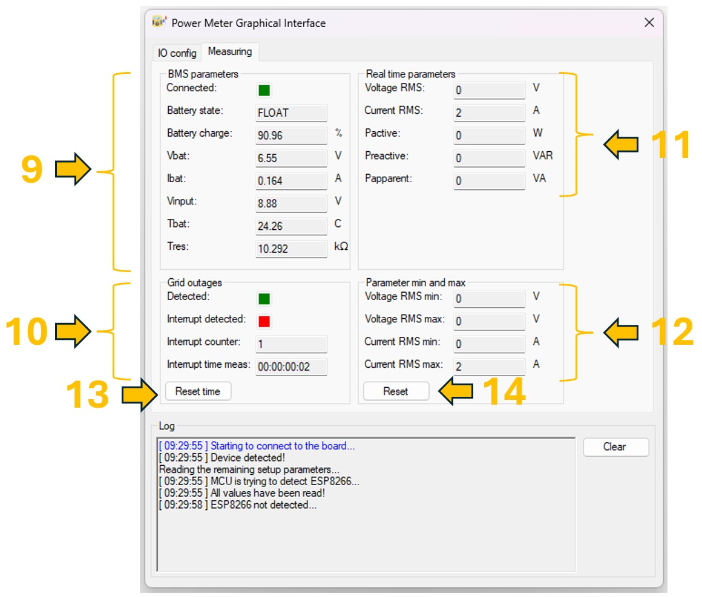

The second tab displays several groups of system parameters:

* **Charger data** - parameters reported by the battery charger ( 9 )
* **Grid outages** - number and duration of detected power interruptions ( 10 )
* **Acquired parameters** - measurements acquired and processed by the dsPIC ( 11 )
* **Maximum values** - maximum recorded values for the monitored parameters ( 12 )

The **Grid outages** and **Parameter min and max** data can be reset using the corresponding buttons ( 13, 14 ).

> [!NOTE]
> Reactive power calculation is not yet implemented. Therefore, the application currently displays **apparent power as equal to active power**.


<!-- ______________________________________________________________________________________________________________________________________________________ -->
# 🥳 Results

The device's power consumption was evaluated under two operating conditions:

1. **Grid-powered operation**, with the ESP8266 enabled and connected to an access point
2. **Battery-powered operation**, with the grid supply unavailable

For the grid-powered test, the device was connected to the electrical grid with the battery disconnected.
The output voltage of the P1 board ( **Vrect** ) was measured using a multimeter.
Due to the impedance of the transformer ( TR1, **Figure 5** ), Vrect varies with the device's power consumption.
The measured voltage was approximately **14 V**.

The P2 board was then powered from a **14 V external voltage source**, replacing the P1 board.
The average device current ( **Ion** ) was approximately **40 mA**, varying between **34 mA and 55 mA**, mainly due to the ESP8266's varying power consumption.

For the battery-powered test, the P2 board was supplied directly from a **6 V voltage source**, corresponding to the nominal battery voltage under load.
The measured current ( **Ioff** ) was approximately **54 mA**.

The power consumption for the two operating conditions ( **Pon** and **Poff** ) was calculated as follows:

$Pon = Vrect * Ion = 14V * 0.040A  = 0.56 W$

$Poff = Vbat * Ioff = 6V * 0.054A = 0.324 W$

The measured results show that the device's power consumption **decreases by almost half during battery-powered operation**, mainly because the ESP8266 is disabled.
Further power savings are planned by placing the two microcontrollers into **sleep mode** during battery operation.

The differential inputs of the **MCP3911** were calibrated by shorting each input pair and measuring the resulting output.
This determines the ADC input offset relative to zero, which is then subtracted from subsequent voltage measurements.

The **RMS calculation algorithm** was initially developed and validated using a signal generator and an oscilloscope.
The measurement accuracy obtained during this validation is presented in **Table 1**.

**TABLE 1: RMS measurement error**
<!DOCTYPE html>
<html>
    <body>
        <table border="1" style="text-align: center">
            <colgroup> <col style="width: 30%" /> <col style="width: 30%" /> <col style="width: 30%" /> <col style="width: 30%" /> <col style="width: 30%" /> </colgroup>
<tr>    <td align="center"><b>Measurement<br>number</b></td>                <td align="center"><b>Signal generator<br>( Vpp_gen( mV ) )</b></td>
        <td align="center"><b>Osciloscope<br>( Vrms_osc( mV ) )</b></td>    <td align="center"><b>Windows application<br>( Vrms_app( mV ) )</b></td>
        <td align="center"><b>Measuring error<br>( % )</b></td>     </tr>
<tr>    <td align="center">1</td>      <td align="center">100</td>    <td align="center">38</td>         <td align="center">36</td>     <td align="center">5.26</td>   </tr>
<tr>    <td align="center">2</td>      <td align="center">200</td>    <td align="center">70.8 </td>      <td align="center">72</td>     <td align="center">-1.69</td>  </tr>
<tr>    <td align="center">3</td>      <td align="center">300</td>    <td align="center">104.8 </td>     <td align="center">109</td>    <td align="center">-4.01</td>  </tr>
<tr>    <td align="center">4</td>      <td align="center">400</td>    <td align="center">142</td>        <td align="center">145</td>    <td align="center">-2.11</td>  </tr>
<tr>    <td align="center">5</td>      <td align="center">500</td>    <td align="center">176.8</td>      <td align="center">182</td>    <td align="center">-2.94</td>  </tr>
<tr>    <td align="center">6</td>      <td align="center">600</td>    <td align="center">212.4</td>      <td align="center">218</td>    <td align="center">-2.64</td>  </tr>
<tr>    <td align="center">7</td>      <td align="center">700</td>    <td align="center">243.2</td>      <td align="center">254</td>    <td align="center">-4.44</td>  </tr>
<tr>    <td align="center">8</td>      <td align="center">800</td>    <td align="center">280.4</td>      <td align="center">291</td>    <td align="center">-3.78</td>  </tr>
<tr>    <td align="center">9</td>      <td align="center">900</td>    <td align="center">316</td>        <td align="center">328</td>    <td align="center">-3.8</td>   </tr>
<tr>    <td align="center">10</td>     <td align="center">1000</td>   <td align="center">350</td>        <td align="center">364</td>    <td align="center">-4</td>     </tr>
        </table>
    </body>
</html>

The average error between the two measurement sets was approximately **≈ −2.415%**.

The ADC inputs were then calibrated using an adjustable **230 VAC power source**.
The source voltage was set to several different values, and the device was powered from it while recording the corresponding measurements.

The calibration results are presented in **Table 2**.

**TABLE 2: Voltage measurement results**
<!DOCTYPE html>
<html>
    <body>
        <table border="1" style="text-align: center">
            <colgroup> <col style="width: 30%" /> <col style="width: 30%" /> <col style="width: 30%" /> <col style="width: 30%" />  </colgroup>
<tr>    <td align="center"><b>Measurement<br>number</b></td>                            <td align="center"><b>Voltage<br>source ( VAC )</b></td>
        <td align="center"><b>Voltage measured by<br>the device ( VAC ) )</b></td>      <td align="center"><b>Measuring error<br>( % )</b></td>     </tr>
<tr>    <td align="center">1</td>      	<td align="center">215</td>    	<td align="center">215.87</td>    	<td align="center">-0.4</td>       </tr>
<tr>    <td align="center">2</td>      	<td align="center">220</td>    	<td align="center">220.52</td>    	<td align="center">-0.24</td>       </tr>
<tr>    <td align="center">3</td>      	<td align="center">225</td>    	<td align="center">225.84</td>    	<td align="center">-0.37</td>       </tr>
<tr>    <td align="center">4</td>      	<td align="center">230</td>    	<td align="center">230.49</td>    	<td align="center">-0.21</td>       </tr>
<tr>    <td align="center">5</td>      	<td align="center">235</td>    	<td align="center">235.8</td>    	<td align="center">-0.34</td>       </tr>
<tr>    <td align="center">6</td>      	<td align="center">240</td>    	<td align="center">240.45</td>    	<td align="center">-0.19</td>       </tr>
        </table>
    </body>
</html>

The average error between the two measurement sets was approximately **≈ −0.3%**.

Initially, the measurement error was significantly higher, reaching **tens of percentage points**, due to DC components in the signals.
These components were amplified by the MCP3911's gain and affected the measurements.

A **digital high-pass filter** was implemented to remove the DC components.
A digital solution was chosen because it is easier to modify and is not affected by component tolerances or drift, unlike a hardware RC high-pass filter.

To calibrate the current measurements, the device was powered from a **230 V source** with the battery disconnected and the Wi-Fi module removed.
Its own consumption was measured at approximately **30 mA**.

A hot-air soldering station and a voltage source were then connected to the device through the extension cord.
The device's own consumption was subtracted from the total current measured by the source to obtain the consumption of the connected load.

The results are presented in **Table 3**.

**TABLE 3: Current measurement results**
<!DOCTYPE html>
<html>
    <body>
        <table border="1" style="text-align: center">
            <colgroup> <col style="width: 30%" /> <col style="width: 30%" /> <col style="width: 30%" /> <col style="width: 30%" /> <col style="width: 30%" />  </colgroup>
<tr>    <td align="center"><b>Measurement<br>number</b></td> 		<td align="center"><b>Current<br>source ( mA )</b></td>             <td align="center"><b>Current measured<br>by the application ( mA )</b></td>
        <td align="center"><b>Measuring error<br>( % )</b></td>         <td align="center"><b>Conditions<br></b></td>       </tr>
<tr>    <td align="center">1</td>   <td align="center">120</td>     <td align="center">120</td>     <td align="center">0</td>       <td>hot air soldering station, at startup</td>   </tr>
<tr>    <td align="center">2</td>   <td align="center">150</td>     <td align="center">150</td>     <td align="center">0</td>       <td>voltage source, no load</td>                 </tr>
<tr>    <td align="center">3</td>   <td align="center">230</td>     <td align="center">240</td>     <td align="center">-4.35</td>   <td>voltage source, 6V 1A load</td>              </tr>
<tr>    <td align="center">4</td>   <td align="center">310</td>     <td align="center">300</td>     <td align="center">3.23</td>    <td>voltage source, 6V 2A loadd</td>             </tr>
<tr>    <td align="center">5</td>   <td align="center">370</td>     <td align="center">390</td>     <td align="center">-5.41</td>   <td>voltage source, 6V 3A load</td>              </tr>
        </table>
    </body>
</html>

The average error between the two measurement sets was approximately **≈ −1.3%**.

Although the relative error is relatively high, the measured currents are very small compared with the **20 A measurement range of the current transformer**.
Therefore, even small absolute deviations result in a larger percentage error.


<!-- ______________________________________________________________________________________________________________________________________________________ -->
# 🌟 Future work

The following features are currently planned for the next iteration:

* **Non-volatile data storage** - implement the procedure for saving measurement and configuration data to flash memory.
* **Reactive power calculation** - add reactive power measurement and update the Windows application accordingly.
* **THDv and THDi measurement** - implement harmonic distortion measurement on the dsPIC and display the results in the Windows application.
* **Fundamental frequency measurement** - calculate and display the grid fundamental frequency.

Several additional improvements could be considered in a future revision:

1. **Reduce the device size and improve portability**
   * Replace the lead-acid battery with a higher-energy-density battery chemistry, such as Li-ion, together with the appropriate protection circuitry.
   * Replace the P1 power transformer with a smaller SMPS.
   * Integrate the boards into a single PCB to further reduce the overall device size.
2. **Reduce dependence on the Windows application**
   * Add a graphical display to the front panel for viewing measurement data. An encoder and menu system could also be added for user interaction.
   * Develop a web-based interface hosted on a server. The device could periodically transmit measurement data through the integrated Wi-Fi module, allowing the data to be viewed and archived remotely without physical access to the device.
3. **Add data visualization to the Windows application**
   * Implement real-time and historical graphs for the measured parameters.
   * The USB-UART bridge supports baud rates up to **460.8 kbaud**, providing sufficient bandwidth for transferring larger amounts of measurement data.
   * Since UART operates in full-duplex mode, the dsPIC and Windows application can transmit data simultaneously.
   * DMA could also be used to further reduce CPU overhead and increase the effective data transfer rate.


<!-- ______________________________________________________________________________________________________________________________________________________ -->
# 🏁 Conclusions

The project successfully achieved its main objective of developing a **custom hardware and software solution for monitoring electrical energy consumption and grid power quality**.

The modular system architecture allows the hardware and software to be extended with additional measurement capabilities and functionality without requiring a complete redesign.
The device integrates **data acquisition, signal processing, communication, battery-backed operation, and PC-based monitoring** into a single system.

The implemented solution can detect and monitor **grid outages, voltage fluctuations, and the energy consumption of connected equipment**, providing the user with information that can help identify power-quality issues and their impact on connected devices.


<!-- ______________________________________________________________________________________________________________________________________________________ -->
# 🔎 Resources

* **PIC16F18346 datasheet**, Microchip — [ link ]( https://ww1.microchip.com/downloads/en/DeviceDoc/PIC16-L-F18326-18346-Data-Sheet-40001839D.pdf )
* **dsPIC33CK256MP205 datasheet**, Microchip — [ link ]( https://ww1.microchip.com/downloads/aemDocuments/documents/MCU16/ProductDocuments/DataSheets/dsPIC33CK256MP508-Family-Data-Sheet-DS70005349.pdf )
* **MCP2221A datasheet**, Microchip — [ link ]( https://ww1.microchip.com/downloads/en/devicedoc/20005565b.pdf )
* **MCP3911 datasheet**, Microchip — [ link ]( https://ww1.microchip.com/downloads/aemDocuments/documents/MSLD/ProductDocuments/DataSheets/MCP3911-3.3V-Two-Channel-Analog-Front-End-DS20002286D.pdf )
* **Design Tips for the MCP3911**, AN1426, Microchip — [ link ]( https://ww1.microchip.com/downloads/en/Appnotes/01426A.pdf )
* **ESP8266 technical reference**, Espressif — [ link ]( https://www.espressif.com/sites/default/files/documentation/esp8266-technical_reference_en.pdf )
* **DS3231 datasheet**, Analog Devices — [ link ]( https://www.analog.com/media/en/technical-documentation/data-sheets/DS3231.pdf )


<!-- ______________________________________________________________________________________________________________________________________________________ -->
# ❓ Glossary

* **ADC** — Analog-to-Digital Converter
* **AFE** — Analog Front End
* **AP** — Access Point
* **CN** — Change Notification
* **COM** — Component Object Model
* **CRC** — Cyclic Redundancy Check
* **CWG** — Complementary Waveform Generator
* **DMA** — Direct Memory Access
* **ESD** — Electrostatic Discharge
* **EUSART** — Enhanced Universal Synchronous Asynchronous Receiver Transmitter
* **I²C** — Inter-Integrated Circuit
* **LDO** — Low-Dropout Regulator
* **LED** — Light-Emitting Diode
* **MCU** — Microcontroller Unit
* **NCO** — Numerically Controlled Oscillator
* **NTC** — Negative Temperature Coefficient
* **PFM** — Pulse-Frequency Modulation
* **PLA** — Polylactic Acid (filament)
* **PLL** — Phase-Locked Loop
* **PWM** — Pulse-Width Modulation
* **RAM** — Random-Access Memory
* **RTC** — Real-Time Clock
* **RTCC** — Real-Time Clock and Calendar
* **SFR** — Special Function Register
* **SMBus** — System Management Bus
* **SMPS** — Switched-Mode Power Supply
* **SPI** — Serial Peripheral Interface
* **STA** — Single-Threaded Apartment
* **THDi** — Total Harmonic Distortion of Current
* **THDv** — Total Harmonic Distortion of Voltage
* **TTL** — Transistor-Transistor Logic
* **TVS** — Transient Voltage Suppression
* **UART** — Universal Asynchronous Receiver/Transmitter
* **USB** — Universal Serial Bus
