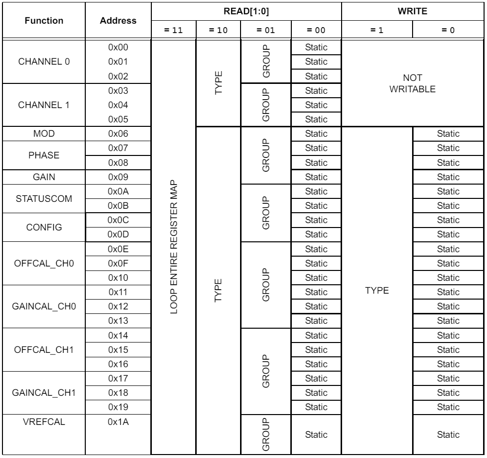

<div align="center">
     
    <h1>Power meter project</h1>
</div>


<!-- ______________________________________________________________________________________________________________________________________________________ INTRODUCTION -->
# :rocket: Introduction

With the increase in the number of consumers connected to the electric grid, the quality of the energy began to decrease. 
Through their operation, high frequency disturbances are introduced into the grid that can affect negatively all the equipment connected to it. 
Electricity distributors must monitor the quality of energy permanently and to ensure that its quality is within the parameters imposed by the responsible authorities.
This way, various unpleasant or dangerous situations that may occur, such as the destruction or incorrect operation of devices, are prevented.

The purpose of the project is to design and develop a hardware and software solution to implement a system that can measure and monitor the energy quality consumed by an equipment connected to the electrical grid.

The results are available in the [Results](#partying_face-results) section.


<!-- ______________________________________________________________________________________________________________________________________________________ TABLE OF CONTENT -->
# :ledger:Table of content

- [:rocket: Introduction](#rocket-introduction)
- [:ledger:Table of content](#ledgertable-of-content)
- [:page\_facing\_up: About the project](#page_facing_up-about-the-project)
  - [Programs used](#programs-used)
  - [File structure](#file-structure)
- [:gear: Components](#gear-components)
  - [PIC16F18346](#pic16f18346)
  - [dsPIC33CK256MP205](#dspic33ck256mp205)
  - [MCP3911](#mcp3911)
  - [ESP8266](#esp8266)
  - [DS3231](#ds3231)
  - [MCP2221A](#mcp2221a)
- [:toolbox: Hardware implementation](#toolbox-hardware-implementation)
  - [Device architecture](#device-architecture)
  - [Board P1 - Rectifier board](#board-p1---rectifier-board)
  - [Board P2 - Battery charger](#board-p2---battery-charger)
  - [Board P3 - Data aquisition board](#board-p3---data-aquisition-board)
  - [Board P4 - dsPIC module](#board-p4---dspic-module)
  - [Final product](#final-product)
- [:computer: Software implementation](#computer-software-implementation)
  - [Microcontroller](#microcontroller)
    - [UART1 and GUI](#uart1-and-gui)
    - [UART2 and ESP8266](#uart2-and-esp8266)
    - [UART3 and BMS](#uart3-and-bms)
    - [I2C2 and DS3231](#i2c2-and-ds3231)
    - [SPI1 and MCP3911](#spi1-and-mcp3911)
    - [POWER\_EN and power grid outage monitoring](#power_en-and-power-grid-outage-monitoring)
  - [Windows application](#windows-application)
- [:partying\_face: Results](#partying_face-results)
- [:anger: Features in progress](#anger-features-in-progress)
- [:star2: Future work](#star2-future-work)
- [:checkered\_flag: Conclusions](#checkered_flag-conclusions)
- [:mag\_right: Resources](#mag_right-resources)
- [:question: Glossary](#question-glossary)


<!-- ______________________________________________________________________________________________________________________________________________________ ABOUT THE PROJECT -->
# :page_facing_up: About the project

The device must monitor the following parameters:
1. Energy consumption of a household appliance, such as a microwave
   1. voltage, current
   2. apparent power
      + active and reactive power components ( **in progress** )
2. Grid energy quality
   1. number of grid outages and their respective durations
   2. voltage fluctuations 
      + gaps, surges
   3. THDv and THDi ( **in progress** )
   4. fundamental frequency  ( **to be added** )
 
A customized device was developed to achieve the previously mentioned objectives.

The device connects directly to the electrical grid, allowing for continuous voltage measurement. 
The user can monitor a household appliance's energy consumption by connecting the appliance to the grid through the device, using the extension cord. 
The consumption and the quality of the energy supplied can be then observed.
After data is acquired, it is processed locally on the device, and the results are transmitted via serial communication to a Windows application.

A WiFi module was included to enable the addition wireless communication later. 
In this way, the data will be transmitted to a server for visualization and to be archived, without requiring physical access to the system.
Configuration parameters of the device ( such as the  WiFi connection parameters ) will be saved by the device into a non-volatile memory.

The circuit is powered in two ways, depending on the availability of grid voltage. 
If the electrical grid is supplying electricity, the device is powered directly from it.
However, in the event of a power failure or grid outage, the power supply automatically switches to an external source.
To achieve this, a battery was added to the system, enabling the circuit to operate for at least 24 hours during a power outage.
Once the power is restored and the grid voltage is available again, the power supply will automatically switch back to the grid power and begins recharging the battery.

The device is composed of several modules, to facilitate the development process and to be able to easily integrate various subsequent improvements. 
For this purpose, 2 microcontrollers are used, one dedicated to the battery charging process and one for the data acquisition. 
The system components are placed in a 3D printed case.


> [!NOTE]
> Saving to flash procedure and the measurements of active, reactive power, THDv, and THDi are in progress, while the fundamental frequency calculation is to be added subsequently.

> [!IMPORTANT]
> The device, ( besides the battery charging part, more precisely the charging algorithm and the digital buck ) was developed by me. 

The acronyms used during the device presentation can be found in the [Glossary](#mag_right-glossary) section, and the resources in the [Resources](#mag_right-resources) section.


<!-- ------------------------------------------------------------------------------------------------------------------------------------------------------ PROGRAMS USED -->
## Programs used

Multiple tools were utilized during the development of the project, and they are listed below:
+ Altium Designer: schematic and PCB design
+ MPLAB X: embedded programming
+ Fusion 360: 3D modeling
+ Prusa Slicer: slicing 3D model and gcode generation

A logic analyzer was used for low level debugging.


<!-- ------------------------------------------------------------------------------------------------------------------------------------------------------ FILE STRUCTURE -->
## File structure

The file structure of the project can be seen in the following figure:
```
.
├── docs
│   └── images ( figures used in README )
└── README.md
```

<!-- ______________________________________________________________________________________________________________________________________________________ COMPONENTS -->
# :gear: Components

<!-- <details>
  <summary>Expand component section...</summary> -->
    
In this section, the components used to implement the device will be presented. 
At first, the component list will be shown, after which the most important capabilities of the main components will be detailed.

The following list contains the components needed to build the device:
+ main components
    + 1x PIC16F18346 8-bit microcontroller
        + [ Link datasheet PIC16F18346 ]( https://ww1.microchip.com/downloads/en/DeviceDoc/PIC16-L-F18326-18346-Data-Sheet-40001839D.pdf )
    + 1x dsPIC33CK256MP205 16-bit microcontroller
        + [ Link datasheet dsPIC33CK256MP205 ]( https://ww1.microchip.com/downloads/aemDocuments/documents/MCU16/ProductDocuments/DataSheets/dsPIC33CK256MP508-Family-Data-Sheet-DS70005349.pdf )
    + 1x MCP3911 AFE synchronous dual channel Σ-Δ ADC
        + [ Link datasheet MCP3911 ]( https://ww1.microchip.com/downloads/aemDocuments/documents/MSLD/ProductDocuments/DataSheets/MCP3911-3.3V-Two-Channel-Analog-Front-End-DS20002286D.pdf )
    + 1x ESP8266 WiFi module
        + [ Link module ESP8266-01S ]( https://ro.mouser.com/ProductDetail/SparkFun/WRL-17146?qs=DPoM0jnrROXqYUXDsg9bzA%3D%3D )
        + [ Link datasheet ESP8266 ]( https://www.espressif.com/sites/default/files/documentation/esp8266-technical_reference_en.pdf )
    + 1x DS3231 extremely accurate RTC ( ±2 ppm for [ 0, +40 ] °C )
        + [ Link datasheet DS3231 ]( https://www.analog.com/media/en/technical-documentation/data-sheets/DS3231.pdf )
    + 1x MCP2221A USB-UART bridge
        + [ Link datasheet MCP2221A ]( https://ww1.microchip.com/downloads/en/devicedoc/20005565b.pdf )
    + custom 3D printed parts
    + 1x power transformer, 1x voltage transformer and 1x current transformer
    + 1x lead-acid battery


<!-- ------------------------------------------------------------------------------------------------------------------------------------------------------ PIC16F18346 -->
## PIC16F18346

The [ PIC16F18346 ]( https://ww1.microchip.com/downloads/en/DeviceDoc/PIC16-L-F18326-18346-Data-Sheet-40001839D.pdf ) microcontroller is used to implement the battery charger. 
The NCO, CWG and PWM modules are used in the battery charging process. 
It also provides an EUSART module that can be used for external communication, and a number of 18 input / output pins. 
Its program memory is 14 kbytes, and the RAM memory is 1 Kbyte.


<!-- ------------------------------------------------------------------------------------------------------------------------------------------------------ dsPIC33CK256MP205 -->
## dsPIC33CK256MP205

The microcontroller chosen for data acquisition, processing and transmission is [ dsPIC33CK256MP205 ]( https://ww1.microchip.com/downloads/aemDocuments/documents/MCU16/ProductDocuments/DataSheets/dsPIC33CK256MP508-Family-Data-Sheet-DS70005349.pdf ). 
It has 48 pins, 256K Flash, a timer, 3 UART, I2C and SPI modules. 
The RAM size of 24K allows the allocation of a larger space to the variables used for data storage and processing. 
It has integrated a CRC module which can be used for implementing data redundancy checks in hardware. 
It contains an 8MHz RC oscillator and 2 programmable PLLs, which can be used to achieve different system clock frequencies. 
The processor clock is different from the system clock, and it can be reduced to lower power consumption. 

Another important reason for choosing this MCU is the fact that it offers 246 sources of interruptions, which can be used to implement the functionality of the device. 
Most of the pin functions can be remapped to optimize the PCB, meaning that a more efficient layout can be obtained.


4 channels of [ DMA ]( https://ww1.microchip.com/downloads/aemDocuments/documents/MCU16/ProductDocuments/DataSheets/dsPIC33CK256MP508-Family-Data-Sheet-DS70005349.pdf#page=211 ) are available, which can be used to perform data moving operation faster, without actively requesting the intervention of the dsPIC.

**FIGURE 1: DMA data transfer types**


The source or destination addresses can be from RAM or from the SFR area ( **Figure 1** ), which means that the DMA can perform the following types of transfers:
1. peripheral - RAM memory
2. RAM memory - RAM memory
3. RAM memory - peripheral
4. peripheral - peripheral

The DMA module has 86 triggers that can be used to initiate data transfers, such as receiving a byte on the UART or triggering a CN interrupt.
The module can move either 8 bits or 16 bits data long.
The DMA controller can operate in 4 modes, namely:
1. **one-shot mode**: a single transfer is made for each trigger received, and when it has made a number of transactions, the channel is deactivated
2. **repeated one-shot mode**: similar to the previous mode, only that at the end the channel is not deactivated, but the initial addresses are resumed, and another transaction starts at the next trigger 
3. **continuous mode**: a single trigger initiates a number of transactions, after which the channel is deactivated 
4. **repeated continuous mode**: a single trigger initiates a number of transactions, after which initial addresses resume, and the cycle resumes at the next trigger

Due to the previously mentioned reasons, the DMA module is ideal for a data acquisition and processing system.

Thus, the chosen microcontroller brings a great deal of flexibility and facilitates the development and integration of subsequent improvements.


<!-- ------------------------------------------------------------------------------------------------------------------------------------------------------ MCP3911 -->
## MCP3911

The voltage and current measurements are made using the AFE [ MCP3911 ]( https://ww1.microchip.com/downloads/aemDocuments/documents/MSLD/ProductDocuments/DataSheets/MCP3911-3.3V-Two-Channel-Analog-Front-End-DS20002286D.pdf ). 
The two input channels are differential, eliminating the common mode voltages between the chip inputs when a measurement is performed, and the acquisition is done synchronously, meaning that there is no phase shift between the two signals.

Another important aspect is that the chip includes two Σ-Δ ADCs. 
The influence of disturbances on the data are minimized by the noise processing.
They were specially designed in such a way that the drifts caused by the temperature are reduced. 
The resolution of the ADCs can be selected between 16 and 24 bits. 

The communication with the MCP3911 is carried out using the SPI serial protocol, which can run up to 20 MHz, and provides a synchronization pulse to signal the completion of the data acquisition cycle.


<!-- ------------------------------------------------------------------------------------------------------------------------------------------------------ ESP8266 -->
## ESP8266

**FIGURE 2: ESP8266 module**


An [ ESP8266-01-S ]( https://www.espressif.com/sites/default/files/documentation/esp8266-technical_reference_en.pdf ) series module ( **Figure 2** ) was added to provide wireless connectivity, more precisely WiFi.
Communication with the module can be done in two ways, through SPI or UART, the latter being the one used in the current application. 
It provides a series of [ AT commands ]( https://room-15.github.io/blog/2015/03/26/esp8266-at-command-reference/ ) ( ATtention ) which can be used to configure the module.

The default baud rate is 115200 Hz, but this value can be changed depending on the project needs.
The operating voltage is 3V3.


<!-- ------------------------------------------------------------------------------------------------------------------------------------------------------ DS3231 -->
## DS3231

The duration of power interruptions on the grid is measured using the [ DS3231 ]( https://www.analog.com/media/en/technical-documentation/data-sheets/DS3231.pdf ), which is an RTCC specially developed for such applications. 
It has a high precision oscillator integrated inside the capsule, with an accuracy of ±2 ppm on the temperature range [ 0, +40 ] °C and ±3.5 ppm on the range [ -40, +85 ] °C.
The aging effect of the oscillator and the temperature variance is compensated using a series of special registers.

The serial communication protocol used by the chip is I2C, and the maximum frequency it can reach is 400 kHz ( Fast mode ). 
It can be configured to generate interruptions with a frequency of 1 Hz, which facilitates the process of measuring grid outages.
The operating voltage is 3V3.


<!-- ------------------------------------------------------------------------------------------------------------------------------------------------------ MCP2221A -->
## MCP2221A

The [ MCP2221A ]( https://ww1.microchip.com/downloads/en/devicedoc/20005565b.pdf )USB-UART bridge was chosen to intermediate the communication between the Windows application and dsPIC, since the laptop or computer uses the USB protocol for serial ports, and the microcontroller does not support direct connection with it. 
It enables data exchange by converting the USB protocol to UART and vice versa, providing bidirectional communication.

The I2C protocol can be used as an alternative to UART, but for reasons of simplicity and data transfer speed, UART was chosen. 
The overhead is minimal in the case of UART, transfering a single byte requiring 10 bits are needed, one for start, one for stop and 8 for data.
The baud rate of the protocol is set to 460800 Hz, with an error of 0.16%.


<!-- ______________________________________________________________________________________________________________________________________________________ HARDWARE IMPLEMENTATION -->
# :toolbox: Hardware implementation

In this section, the hardware implementation of the device will be detailed.

For each board, the block diagram will be presented, where the connections between the components can be seen. 
To represent the functionality they fulfill, the following colors were used:

- ${\textsf{\color{green}green}}$  - AC power supply
- ${\textsf{\color{red}red}}$, ${\textsf{\color{blue}blue}}$ and black - DC power supply
- ${\textsf{\color{orange}orange}}$ - analog signals
- ${\textsf{\color{purple}purple}}$ - digital signals


<!-- ------------------------------------------------------------------------------------------------------------------------------------------------------ Device architecture -->
## Device architecture

The functionality of the device was divided into 4 PCBs, as follows:

- **Board P1 ( Rectifier )**: takes the 230 VAC voltage from the electrical grid and transforms it into DC ( 9V at 0.833A load ) to power the device; the power transformer is placed on this board
- **Board P2 ( Battery charger )**: provides power to the rest of the device; when the grid voltage is present, the board will charge the battery, and when it stops, it will use the battery as a power source to keep the device running; the PIC16F is placed on this board
- **Board P3 ( Data acquisition )**: deals with data acquisition, manages the communication with the computer and provides two connectors where the dsPIC module ( the following board ) can be inserted; the MCP2221A, MCP3911 and the ESP8266 module are placed on this board, and the current and voltage transformers connect to the board using a series of cables
- **Board P4 ( dsPIC module )**: is a module with the main microcontroller; it process the data acquired by P3 board; the dsPIC and the RTC DS3231 are placed on this board

The architecture of the entire system can be seen in the figure below. 

**FIGURE 3: Device architecture**


Some components will be turned on or off depending on the status of the grid, to increase the energy efficiency of the device when the battery is used to power up the system.

> [!IMPORTANT]
> The device ( besides the battery charging part, more precisely the charging algorithm and the digital buck ) was developed by me.

<!-- ------------------------------------------------------------------------------------------------------------------------------------------------------ Board P1 - rectifier board-->
## Board P1 - Rectifier board

**FIGURE 4: P1 functional block**


The block diagram of the board is shown in **Figure 4**. 
As previously mentioned, its role is to rectify the 230 VAC voltage from the grid and transform it into DC ( 9V at 0.833A ) to power the device. 


<!-- ------------------------------------------------------------------------------------------------------------------------------------------------------ Board P2 - battery charger -->
## Board P2 - Battery charger

**FIGURE 5: P2 functional block**


The block diagram of the board is presented in **Figure 5**. 
This board is responsible with the power supply management of the P3 and P4 boards and the battery charging. 
The lead-acid battery will be charged when the electrical grid provides energy. 
If it fails to deliver, the board will switch the power to the battery, to keep the device running. 

The board supplies the 3V3 voltage for the digital and analog part of the rest of the boards. 
The battery temperature is monitored with an NTC thermistor, whose resistance decreases as the temperature increases. 

The battery voltage, charging current and battery state, and the board temperature and input voltage are monitored periodically by the dsPIC using a serial communication ( UART3 ).
The POWER EN signal indicates that the device is powered from the grid ( logical '1' ), or from the battery ( logical '0' ). 


<!-- ------------------------------------------------------------------------------------------------------------------------------------------------------ Board P3 - Data aquisition board -->
## Board P3 - Data aquisition board

**FIGURE 6: P3 functional block**


The block diagram of the board is presented in **Figure 6**. 
This board handles the data acquisition, manages the communication with the Windows application and facilitates the exchange of information between the device components. 
Two switches and one LDO to accelerate the development process of the device ( allowing the P3 and P4 boards to be powered using the USB only, without the need of using an auxiliary power source or the entire assembly ).


<!-- ------------------------------------------------------------------------------------------------------------------------------------------------------ Board P4 - dsPIC module -->
## Board P4 - dsPIC module

**FIGURE 7: P4 functional block**


The block diagram of the board is presented in **Figure 7**. 
The dsPIC33CK256MP205 microcontroller and the RTC are located on this board. 
The main roles of the board are to manage communications and to process the data acquired by P3. 


<!-- ------------------------------------------------------------------------------------------------------------------------------------------------------ FINAL PRODUCT -->
## Final product

The device components have been placed in a case specially developed to meet the needs of the system. 
The case was printed using a 3D printer. 

**FIGURE 8: Device compoenents**


**FIGURE 9: Device functioning**


The device can be seen operating in **Figure 9**, where it was powered from the outlet, and a hot air soldering station was connected to it through the extension cord. 
Thus, its consumption is measured permanently and the results can be viewed using the Windows application.


<!-- ______________________________________________________________________________________________________________________________________________________ SOFTWARE IMPLEMENTATION -->
# :computer: Software implementation
    
In this section, the software implementation of the device will be detailed.

The software architecture of the system was designed in such a way that the written code is non-blocking ( the application, the battery charger and dsPIC ).
This way, the operation of the device becomes much more robust, because if a component of the device is no longer operating within the established parameters and stops, it will not halt the rest of the system.

Since there are multiple interrupts used to implement the functionality, special care was taken to prevent concurrent access to the same data between the main loop and interrupt handlers.


<!-- ------------------------------------------------------------------------------------------------------------------------------------------------------ Microcontroller -->
## Microcontroller

At the base of the entire system is the dsPIC, which has the role of implementing most of the device's functions. 
It manages five state machines for communications, which run in parallel, and these are presented below:
+ **UART1** - with Windows application
+ **UART2** - with ESP8266 ( WiFi module )
+ **UART3** - with battery charger board
+ **SPI1** - with MCP3911 ( external ADC )
+ **I2C2** - with DS3231 ( RTCC )

The dsPIC works as a master for all communications except UART1, where the application is the one that controls the transactions.
The following subsections will present the dsPIC's functionalities.


<!-- ------------------------------------------------------------------------------------------------------------------------------------------------------ UART1 and GUI -->
### UART1 and GUI

The [ UART1 communication ]( https://ww1.microchip.com/downloads/aemDocuments/documents/MCU16/ProductDocuments/DataSheets/dsPIC33CK256MP508-Family-Data-Sheet-DS70005349.pdf#page=363 ) takes place between the Windows application and dsPIC, where the application sends a series of commands to which the latter must respond.
The serial module runs in full-duplex mode, the communication baud rate is set to 460800 Hz, and the format is 8N1.
CRC checks are used for robustness.

The communication resets in case of a timeout error, wrongly received CRC, overflow, frame error or if an unknown command is received.
Two types of commands are implemented, read and write, and they can have either fixed or variable length.
The functionality is achieved using 21 commands.

> [!NOTE]  
> The procedure of saving data to a non-volatile memory is not finished yet, only the UART commands are implemented at the current time.

<!-- ------------------------------------------------------------------------------------------------------------------------------------------------------ UART2 and ESP8266 -->
### UART2 and ESP8266

The [ UART2 communication ]( https://ww1.microchip.com/downloads/aemDocuments/documents/MCU16/ProductDocuments/DataSheets/dsPIC33CK256MP508-Family-Data-Sheet-DS70005349.pdf#page=363 ) takes place between the dsPIC and the [ ESP8266 ]( https://www.espressif.com/sites/default/files/documentation/esp8266-technical_reference_en.pdf ) WiFi module.
The data exchange between the two components is carried out using a set of [ AT commands ]( https://room-15.github.io/blog/2015/03/26/esp8266-at-command-reference/ ) ( ATtention ) sent over the serial.
It runs in full-duplex mode, the communication baud rate is set to 115200 Hz, and the format is 8N1.
Since there is no server to which the module can transmit data for now, only the ESP8266 configuration and its connection / disconnection to an AP have been implemented.
The WiFi module will be turned on when the device is powered up from the grid, and off when the battery is used.
The state machine can be seen in **Figure 10**.


**FIGURE 10: ESP8266 state machine**


At the beginning, the parameters to be connected ( "wifi_SSID" and "wifi_pass" ) are initialized with some default values, but which can be modified later through the Windows application.
The module is stopped if it does not respond to the initial queries with the expected sequence within 5 seconds for configuration states, or if the electrical grid no longer supplies energy.


<!-- ------------------------------------------------------------------------------------------------------------------------------------------------------ UART3 and BMS -->
### UART3 and BMS
 
[ UART3 communication ]( https://ww1.microchip.com/downloads/aemDocuments/documents/MCU16/ProductDocuments/DataSheets/dsPIC33CK256MP508-Family-Data-Sheet-DS70005349.pdf#page=363 ) takes place between the dsPIC and the battery charger board.
Transactions are initiated only by dsPIC, which periodically reads the parameters of interest by sending reading commands to the battery charger, to which the latter must respond.
The monitoring parameters are the following: status, state, voltage, charging current and temperature of the battery, and the voltage at the input of the P2 board.
UART3 runs in full-duplex mode, the communication baud rate is set to 38400 Hz, and the format is 8N1.

The implemented commands are read-only, and have a fixed length.
The communication resets in case of a timeout error, XOR received incorrectly, overflow, frame error or in case of receiving an unknown command.


<!-- ------------------------------------------------------------------------------------------------------------------------------------------------------ I2C2 and DS3231 -->
### I2C2 and DS3231

The [ I2C2 communication ]( https://ww1.microchip.com/downloads/aemDocuments/documents/MCU16/ProductDocuments/DataSheets/dsPIC33CK256MP508-Family-Data-Sheet-DS70005349.pdf#page=403 ) is used by dsPIC to configure the [ RTC DS3231 ]( https://www.analog.com/media/en/technical-documentation/data-sheets/DS3231.pdf ). 
The serial communication frequency was set to 100 kHz, corresponding to the standard mode. 
Addressing a slave can be done using 7 or 10 bits, the first being the version used.
The functionality of the I2C pins can be moved to a single alternate port, unlike the most whose functions can be reassigned to any RPx pins.
This fact is due to the special circuits tied on their respective pins, which can also be used for SMBus.
The RTC will be turned on when the device is powered up from the battery, to measure the length of the grid outages, and off when the grid suppies energy.

The communication resets if timeout error occurs, more precisely if the DS3231 does not respond to commands within a specific time, if the address is not acknowledged or if the chip configuration could not be written.


**FIGURE 11: I2C read write example**


The logic of the state machine corresponding to the I2C2 communication was implemented starting from the example provided in **Figure 11**. 
The communication takes place on the MI2C2IF interrupt, where the control signals are processed and data transmission and reception occurs.


**FIGURE 12: DS3231 register list**


The list of DS3231 registers can be seen in **Figure 12**. 
The chip provides 13 configuration registers. 
It has implemented a calendar, with correction for leap years, but at the moment this functionality is not used by the application. 
In the future, it offers the possibility to keep track of both the duration of power outages, as well as the date, time and interval in which they occur. 
The respective data can be saved in a non-volatile memory, after which they can be read and forwarded to the Windows application.
The DS3231 can generate 2 alarms, but they are not used. 
It is capable of generating rectangular signals of different frequencies, more precisely 1 Hz, 1.024, 4.096 or 8.192 kHz, with 1 Hz being chosen for measuring power interrupts.

The internal oscillator is responsible for accurately generating the clock signal. 
Its deviation, caused both by the temperature at which the chip operates and by the aging process of the oscillator, is internally compensated. 
As it ages, the dsPIC can adjust the frequency using the offset register ( the one with the Aging offset function ). 
The temperature reading of the sensor is not used, as there is already an NTC thermistor placed near the battery to monitor it.


<!-- ------------------------------------------------------------------------------------------------------------------------------------------------------ SPI1 and MCP3911 -->
### SPI1 and MCP3911

The [ SPI1 communication ]( https://ww1.microchip.com/downloads/aemDocuments/documents/MCU16/ProductDocuments/DataSheets/dsPIC33CK256MP508-Family-Data-Sheet-DS70005349.pdf#page=385 ) is used to transfer data between dsPIC and [ AFE MCP3911 ]( https://ww1.microchip.com/downloads/aemDocuments/documents/MSLD/ProductDocuments/DataSheets/MCP3911-3.3V-Two-Channel-Analog-Front-End-DS20002286D.pdf ).
The serial communication frequency was set to 10 MHz, the operating mode is 1.1 ( the polarity of the CLK signal when it is in the idle state is high, and data is acquired on the falling edge of the clock, and on the rising edge they are moved ).
The module buffers are of two types, Standard and Enhanced. The latter was used, because it uses a 128-bit FIFO mechanism for data transmission and reception. 
The word length was set to 8 bits, which means that the depth of the FIFO is 16 words.

**FIGURE 13: MCP3911 register list**



The structure of the registers of the MCP3911 chip can be seen in **Figure 13**.
The current consumption of the ADCs was not limited, which allows a higher sampling frequency. 
Their resolution is set to 16 bits, but 24 bits can be also used. 
The nDR ( Data Ready ) pulse was configured to be generated only once, when the data of both channels is ready. 
The nDR remains high while the data is not ready.

One of the most important aspects of this chip is that the registers are organized into several groups, according to the operations that can be performed on them ( **Figure 47** ). 
In this case, the addresses for reading and writing operations are reloaded according to the type of registers ( READ[1:0] = 0b10 and WRITE = 0b1 ). 
This way, the ADC data can be read continuously, without the need to change the address counter manually, meaning that the overhead is minimal.

**FIGURE 14: MCP3911 clock structure**


The structure of the MCP3911 clock can be seen in **Figure 14**. 
The formula for calculating DRCLK ( Data Rate Clock ) is as follows:

$DRCLK = \frac{DMCLK}{OSR}= \frac{AMCLK}{4 * OSR}= \frac{MCLK}{4 * OSR * PRESCALE}$

As the provided external oscillator has a frequency of 10 MHz, the OSR was set to 512 ( OSR[2:0] = 0b100 ), and the prescaler to 1 ( PRE[1:0] = 0b00 ), the DRCLK value is as follows:

$DRCLK = \frac{10 MHz}{4 * 512 * 1} \approx 4,883 Hz$

According to Niquist's criterion, the respective sampling frequency allows the reproduction of signal characteristics up to ≈ 2,441Hz.

**FIGURE 15: MCP3911 data acquisition**


An example of data transfer between with the MCP3911 can be seen in **Figure 15**.
After configuring the chip, the dsPIC starts the data reading process by writing the starting address of the CHANNEL 0 register, after which at each pulse of the nDR signal generated by the MCP3911, 4 bytes are sent by the microcontroller to read the AFE data.

Moreover, the number of necessary operations is reduced even further with DMA.
It was configured in repeated continuous mode, in which the trigger of the data moving process is the interruption of the nDR signal, the source address is the SPI1BUFL buffer ( where data is written and read over SPI1 ), the destination is a variable of 32 bits, and the number of transmitted bytes is 4.
When nDR goes from "0" to "1", the DMA starts a symmetric null write operation, where the data from the variable address is written into SPI1BUFL, and the results provided by the MCP3911 are read and written back to the variable address.

The symmetric null write process resumes at the next pulse of the nDR.

After the transaction is completed and the SPI transmit buffer is emptied, a flag is set to signal that a new set of data has been received. 
The new data is processed on the main loop, where the flag is cleared. 


**FIGURE 16: MCP3911 state machine**


The state machine behind the MCP3911 can be seen in **Figure 16**.
The AFE is turned on or off at the beginning depending on the value of the POWER_EN signal ( '1' means on and '0' off ).
The start-up sequence was carried out according to the one recommended in the MCP3911 datasheet.
First, the chip was reset and the ADCs were turned off, after which the previously presented configuration was written.
Afterwards, it is read to check if it was written successfully.
If the two configurations differ, the part is stopped, and if not, the starting address of the CHANNEL 0 register is written and data acquisition begins.
The chip can also be turned off if the grid stops supplying power.


<!-- ------------------------------------------------------------------------------------------------------------------------------------------------------ POWER_EN and power grid outage monitoring -->
### POWER_EN and power grid outage monitoring

The values ​​of the POWER_EN signal ( which is provided by the PIC16F from the battery charger ) are either logic '0' or '1' ( 0V and approximately 3.2V after the voltage divider ).
This signal indicates whether the grid supplies power ( '1' logic ) or not, in which case the device is powered by the battery ( '0' logic ).
The transition between the two states is made according to the input voltage of P2, using a hysteresis interval, where the minimum threshold is 8V and the maximum is 9V.

The dsPIC constantly monitors the POWER_EN signal to establish the state of the grid.
To change its state, the signal must remain in the new state for at least 100 milliseconds without interruption.
When a power outage is detected, the power is switched to the battery automatically by the OR diode gate ( **Figure 5** ), and most of the device's functionality is turned off ( ESP8266 and MCP3911 ).
The RTC DS3231 is then turned on and configured to generate a rectangular signal of 1 Hz, and a counter is incremented at each transition from '0' to '1' logic.
Another counter is used to keep track of the number of power outages detected.
The counters can be viewed and reset using the Windows application.
When the grid power returns to normal, the RTC is turned off, and ESP8266 and MCP3911 are turned on.

Since it is desired to evaluate the consumption of a device in AC, it is necessary to calculate the RMS values ​​of the current and voltage. 
The length of both buffers is 293 elements.


<!-- ------------------------------------------------------------------------------------------------------------------------------------------------------ Windows application -->
## Windows application

The Windows application was developed using **.NET Framework 4.7**.
It was chosen due to its stability, being tested and used by many users over time, but also due to the resources available on the Internet.
The application was written using the C# programming language together with the Winforms libraries, which were developed especially for such situations.
The implementation time of the solution is significantly reduced due to the multitude of classes that are available.

The application can be seen in **Figure 17** and **Figure 18**.

**FIGURE 17: Windows application first page**

 

The application is organized in two tab pages ( 1 ).
On the first page, the user can configure the serial communication, more precisely select the port and the baudrate to be used, observe the connection status, start the communication with the previous settings and reset the application ( 2 ).
At the bottom of the window, the application displays various messages of interest ( 3 ), which can be deleted using the "Clear" button ( 4 ).
The connection status with the ESP8266 WiFi module can be easily monitored ( 5 ), because several controls and various colors were used, namely: gray, which means that the module has not reached the respective state, orange indicates that it is in process, and green as completed successfully.
There are several text boxes in which the connection parameters for the router and server ( 6 ) can be changed ( 7 ).
Starting or ending a connection can be done by using the associated buttons ( 8 ).
It should be mentioned that the I/O buttons are available depending on the state of the module.


**FIGURE 18: Windows application second page**


In the second page, several parameters can be monitored: the data provided by the charger ( 9 ), the number and duration of power interruptions ( 10 ), the parameters acquired and processed by dsPIC ( 11 ), and the respective maximum values ( 12 ).
The parameters in the "Grid outages" and "Parameter min and max" sections can be reset by two buttons ( 13, 14 ).


> [!NOTE]  
> The reactive power calculation is not finished at this time, so the apparent power is displayed as being equal to the active power by the application.


<!-- ______________________________________________________________________________________________________________________________________________________ RESULTS -->
# :partying_face: Results
    
Initially, the consumption of the device was evaluated when it was powered from the electrical grid and from the battery. 
To achieve this, the device was connected to the grid with the WiFi module turned on and connected to an AP and with the battery disconnected.
The voltage at the output of the P1 board was measured using a multimeter.
Vrect varies depending on the consumption of the device, due to the impedance of the transformer ( TR1, **Figure 5** ).
The measured voltage was 14V.
The P2 board was then powered from a 14V voltage source, replacing the P1 board.
The current consumed by the device ( Ion ) was approximately 40 mA on average, but this varies in the range [ 34 mA, 55 mA ] due to the ESP8266 module.
Later, the P2 board was powered only from the voltage source instead of the battery, at a voltage of 6V ( nominal value when a consumer is connected to it ).
The current measured in this case ( Ioff ) was 54 mA.

The power consumed by the device in the two cases ( Pon and Poff ) were calculated as follows:

$Pon = Vrect * Ion = 14V * 0.040A  = 0.56 W$

$Poff = Vbat * Ioff = 6V * 0.054A = 0.324 W$

As seen, the power consumed by the device almost halved when the power was switched to battery, mainly due to the WiFi module being turned off, whose consumption is quite high.
Subsequently, the transition of the two microcontrollers into sleep mode will be implemented to save even more energy while the device is using the battery.


The differential inputs of the MCP3911 chip were calibrated by short-circuiting them to each other, and the voltages were read afterward.
Through this method, the values of the offsets that the ADC inputs have with respect to 0 were found and subtracted from the voltage readings.


In the first phase, the algorithm for calculating the RMS values was developed using a signal generator and an oscilloscope.
The results can be seen in **Table 1**.


**TABLE 1: Error RMS measurement results**
<!DOCTYPE html>
<html>
    <body>
        <table border="1" style="text-align: center">
            <colgroup> <col style="width: 30%" /> <col style="width: 30%" /> <col style="width: 30%" /> <col style="width: 30%" /> <col style="width: 30%" /> </colgroup>
<tr>    <td align="center"><b>Measurement<br>number</b></td>                <td align="center"><b>Signal generator<br>( Vpp_gen( mV ) )</b></td>       
        <td align="center"><b>Osciloscope<br>( Vrms_osc( mV ) )</b></td>    <td align="center"><b>Windows application<br>( Vrms_app( mV ) )</b></td>   
        <td align="center"><b>Measuring error<br>( % )</b></td>     </tr>
<tr>    <td align="center">1</td>      <td align="center">100</td>    <td align="center">38</td>         <td align="center">36</td>     <td align="center">5.26</td>   </tr>
<tr>    <td align="center">2</td>      <td align="center">200</td>    <td align="center">70.8 </td>      <td align="center">72</td>     <td align="center">-1.69</td>  </tr>
<tr>    <td align="center">3</td>      <td align="center">300</td>    <td align="center">104.8 </td>     <td align="center">109</td>    <td align="center">-4.01</td>  </tr>
<tr>    <td align="center">4</td>      <td align="center">400</td>    <td align="center">142</td>        <td align="center">145</td>    <td align="center">-2.11</td>  </tr>
<tr>    <td align="center">5</td>      <td align="center">500</td>    <td align="center">176.8</td>      <td align="center">182</td>    <td align="center">-2.94</td>  </tr>
<tr>    <td align="center">6</td>      <td align="center">600</td>    <td align="center">212.4</td>      <td align="center">218</td>    <td align="center">-2.64</td>  </tr>
<tr>    <td align="center">7</td>      <td align="center">700</td>    <td align="center">243.2</td>      <td align="center">254</td>    <td align="center">-4.44</td>  </tr>
<tr>    <td align="center">8</td>      <td align="center">800</td>    <td align="center">280.4</td>      <td align="center">291</td>    <td align="center">-3.78</td>  </tr>
<tr>    <td align="center">9</td>      <td align="center">900</td>    <td align="center">316</td>        <td align="center">328</td>    <td align="center">-3.8</td>   </tr>
<tr>    <td align="center">10</td>     <td align="center">1000</td>   <td align="center">350</td>        <td align="center">364</td>    <td align="center">-4</td>     </tr>
        </table>
    </body>	
</html>

The average error between the two measurement sets is ≈ -2.415 %.


Next, the ADC inputs were calibrated using a voltage source capable of providing 230VAC.
The power source was set to various voltages and the device was powered from it to measure the respective values.
The results can be seen in **Table 2**.

**TABLE 2: Voltage measurement results**
<!DOCTYPE html>
<html>
    <body>
        <table border="1" style="text-align: center">
            <colgroup> <col style="width: 30%" /> <col style="width: 30%" /> <col style="width: 30%" /> <col style="width: 30%" />  </colgroup>
<tr>    <td align="center"><b>Measurement<br>number</b></td>                            <td align="center"><b>Voltage<br>source ( VAC )</b></td>                
        <td align="center"><b>Voltage measured by<br>the device ( VAC ) )</b></td>      <td align="center"><b>Measuring error<br>( % )</b></td>     </tr>
<tr>    <td align="center">1</td>      	<td align="center">215</td>    	<td align="center">215.87</td>    	<td align="center">-0.4</td>       </tr>
<tr>    <td align="center">2</td>      	<td align="center">220</td>    	<td align="center">220.52</td>    	<td align="center">-0.24</td>       </tr>
<tr>    <td align="center">3</td>      	<td align="center">225</td>    	<td align="center">225.84</td>    	<td align="center">-0.37</td>       </tr>
<tr>    <td align="center">4</td>      	<td align="center">230</td>    	<td align="center">230.49</td>    	<td align="center">-0.21</td>       </tr>
<tr>    <td align="center">5</td>      	<td align="center">235</td>    	<td align="center">235.8</td>    	<td align="center">-0.34</td>       </tr>
<tr>    <td align="center">6</td>      	<td align="center">240</td>    	<td align="center">240.45</td>    	<td align="center">-0.19</td>       </tr>
        </table>
    </body>	
</html>

The average error between the two measurement sets is ≈ -0.3 %.
Initially, the error was a lot bigger ( in the order of tens of percentage units ) because of the presence of DC components, which were further amplified by the gain of the MCP3911.
A high-pass filter was implemented to remove the those components from the signals. 
In this case, the filter is implemented digitally, because it is simpler, easier to modify and doesn't suffer from component drifts ( such as in the case of the capacitor in a RC high-pass filter ).


To calibrate the current measurements, the device was powered from the 230V source, with the battery disconnected and the WiFi module removed.
Thus, its consumption was measured, its value being 30mA. 
After this step, a hot air soldering station and a voltage source were connected to the device through the extension cord.
The consumption of the device was subtracted from the total consumption indicated by the source.
The results can be seen in **Table 3**.

**TABLE 3: Current measurement results**
<!DOCTYPE html>
<html>
    <body>
        <table border="1" style="text-align: center">
            <colgroup> <col style="width: 30%" /> <col style="width: 30%" /> <col style="width: 30%" /> <col style="width: 30%" /> <col style="width: 30%" />  </colgroup>
<tr>    <td align="center"><b>Measurement<br>number</b></td> 		<td align="center"><b>Current<br>source ( mA )</b></td>             <td align="center"><b>Current measured<br>by the application ( mA )</b></td>                
        <td align="center"><b>Measuring error<br>( % )</b></td>         <td align="center"><b>Conditions<br></b></td>       </tr>
<tr>    <td align="center">1</td>   <td align="center">120</td>     <td align="center">120</td>     <td align="center">0</td>       <td>hot air soldering station, at startup</td>   </tr>
<tr>    <td align="center">2</td>   <td align="center">150</td>     <td align="center">150</td>     <td align="center">0</td>       <td>voltage source, no load</td>                 </tr>
<tr>    <td align="center">3</td>   <td align="center">230</td>     <td align="center">240</td>     <td align="center">-4.35</td>   <td>voltage source, 6V 1A load</td>              </tr>
<tr>    <td align="center">4</td>   <td align="center">310</td>     <td align="center">300</td>     <td align="center">3.23</td>    <td>voltage source, 6V 2A loadd</td>             </tr>
<tr>    <td align="center">5</td>   <td align="center">370</td>     <td align="center">390</td>     <td align="center">-5.41</td>   <td>voltage source, 6V 3A load</td>              </tr>
        </table>
    </body>	
</html>

The average error between the two measurement sets is ≈ -1.3 %.

It should be mentioned that although the errors are large, the current values ​​are very small, the measurement range of the current transformer being up to 20A.


<!-- ______________________________________________________________________________________________________________________________________________________ Features in progress -->
# :anger: Features in progress

The following features are being worked on:
+ Saving to flash procedure
+ Adding reactive power calculation
+ Adding THDv and THDi measuring capability to the dsPIC and Windows application

The following features will be added subsequently after the previous ones are implemented:
+ measuring fundamental frequency

<!-- ______________________________________________________________________________________________________________________________________________________ FUTURE WORK -->
# :star2: Future work

There are several aspects which could be added / improved in a following revision. The main ones are listed below:
1. The dimensions of the device could be reduced, making the device more portable
    + The lead-acid battery could be changed with another battery type with a different chemistry, such as a Li-ion, which has a bigger energy density; of course, if using a more volatile chemistry, multiple protection circuits should be added to prevent different unwanted scenarios ( such as discharging the battery too much, below the low limit threshold )
    + The board P1 could be replaced with a SMPS board, thus replacing the power transformer, which is pretty big and heavy
    + All the board could be merged into a single PCB, futher reducing the size of the device
2. Alternatives to the Windows application can be provided, so that the user doesn't need to use the laptop every time he wishes to monitor the device
    + A graphic display could be added on the front side of the device, since there are a lot of pins left unused; also, an encoder could be used, and a menu could be implemented to help the user viewing the proccesed data
    + A website could be developed and hosted on a server, to which the power meter could send data periodically to be viewed and archived, using the provided WiFi module; this way, the user doesn't need physical access to the device
3. Graph viewing functionality could be implemented in the GUI, to provide a visual representation of the data; since the USB-UART bridge supports up to 460.8 kHz baud rate, a lot of data can be transmitted; also, both dsPIC and Windows application could send data at the same time, taking advantage of the UART's full-duplex mode; DMA could be used to increase the data transmission rate even further


<!-- ______________________________________________________________________________________________________________________________________________________ CONCLUSION -->
# :checkered_flag: Conclusions

In conclusion, the aim of the project to design a combined hardware and software solution for implementing a customized device, which can acquire, monitor and display multiple parameters related to the quality of the energy supplied from the electrical grid was accomplished.

The system architecture was designed so that the device consists of modules, which facilitates the integration of various possible improvements and new functionalities, until a final version is reached.
This device solves the problem of detecting disturbances on the grid and helps the user to identify them and, subsequently, to fix them.


<!-- ______________________________________________________________________________________________________________________________________________________ RESOURCES -->
# :mag_right: Resources

+ PIC16F18346 datasheet, Microchip, [ link ]( https://ww1.microchip.com/downloads/en/DeviceDoc/PIC16-L-F18326-18346-Data-Sheet-40001839D.pdf )
+ dsPIC33CK256MP205 datasheet, Microchip, [ link ]( https://ww1.microchip.com/downloads/aemDocuments/documents/MCU16/ProductDocuments/DataSheets/dsPIC33CK256MP508-Family-Data-Sheet-DS70005349.pdf )
+ MCP2221A datasheet, Microchip, [ link ]( https://ww1.microchip.com/downloads/en/devicedoc/20005565b.pdf )
+ MCP3911 datasheet, Microchip, [ link ]( https://ww1.microchip.com/downloads/aemDocuments/documents/MSLD/ProductDocuments/DataSheets/MCP3911-3.3V-Two-Channel-Analog-Front-End-DS20002286D.pdf )
+ "Design Tips for the MCP3911", AN1426, Microchip, [ link ]( https://ww1.microchip.com/downloads/en/Appnotes/01426A.pdf )
+ ESP8266 datasheet, Espressif, [ link ]( https://www.espressif.com/sites/default/files/documentation/esp8266-technical_reference_en.pdf )
+ DS3231 datasheet, Analog devices, [ link ]( https://www.analog.com/media/en/technical-documentation/data-sheets/DS3231.pdf )


<!-- ______________________________________________________________________________________________________________________________________________________ GLOSSARY -->
# :question: Glossary
+ ADC - Analog to Digital Converter
+ AFE - Analog Front End
+ AP - Access Point
+ CN - Change Notification
+ COM - Component Object Model
+ CRC - Cyclic Redundancy Check
+ CWG - Complementary Waveform Generator
+ DMA - Direct Memory Access
+ ESD - ElectroStatic Discharge
+ EUSART - Enhanced Universal Synchronous Asynchronous Receiver Transmitter
+ I2C - Inter-Integrated Circuit
+ LDO - Low Dropout regulator
+ LED - Light Emitting Diode
+ MCU - MicroController Unit
+ NCO - Numerically Controlled Oscillator
+ NTC - Negative Temperature Coefficient
+ PFM - Pulse-Frequency Modulation
+ PLA - Polylactic Acid ( filament )
+ PLLs - Phase-Locked Loop
+ PWM - Pulse-Width Modulation
+ RAM - Random-Access Memory
+ RTC - Real Time Clock
+ RTCC - Real Time Clock and Calender
+ SFR - Special Function Register
+ SMBus - System Management Bus
+ SMPS - Switched-Mode Power Supply
+ SPI - Serial Peripheral Interface
+ STA - Single Threaded Apartment
+ THDi - Total harmonic distortion relative to Current
+ THDv - Total harmonic distortion relative to Voltage
+ TTL - Transistor-Transistor Logic
+ TVS - Transient Voltage Suppression
+ UART - Universal Asynchronous receiver / transmitter
+ USB - Universal Serial Bus

